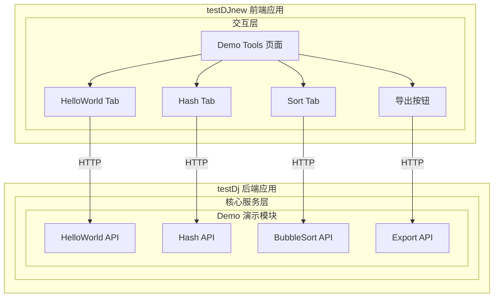
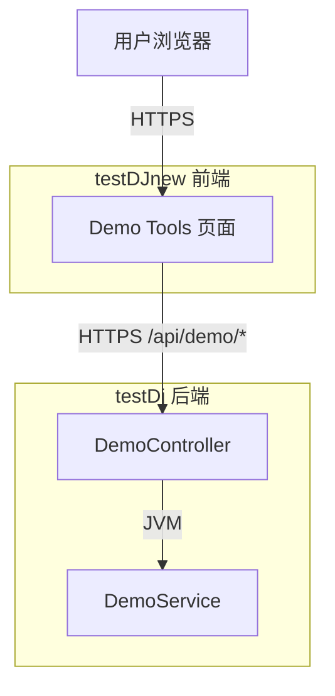
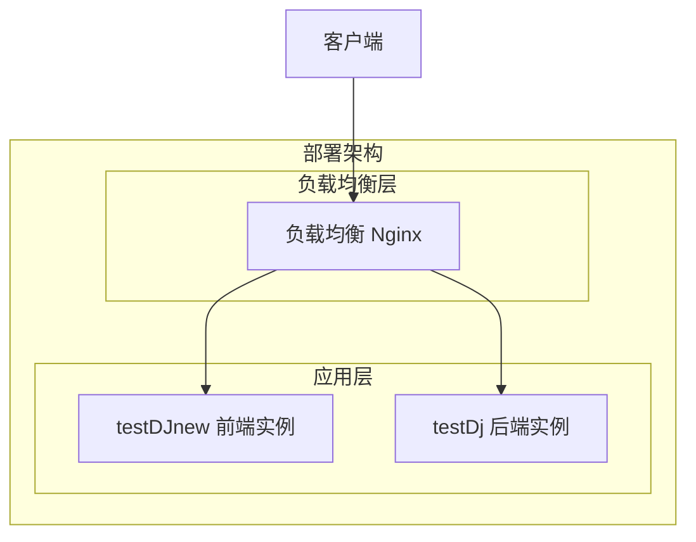
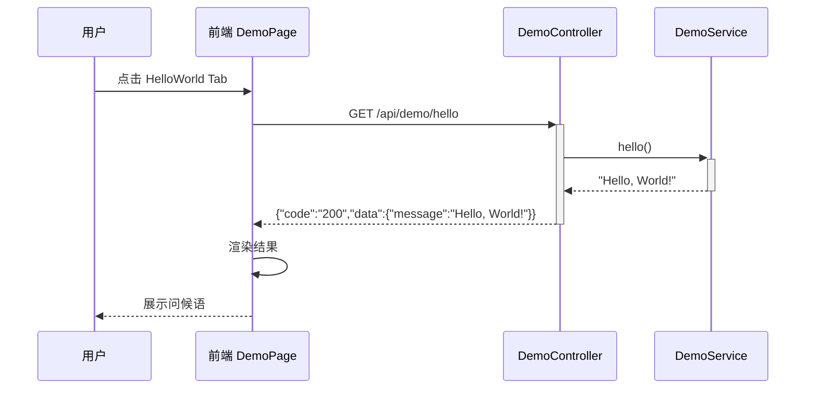
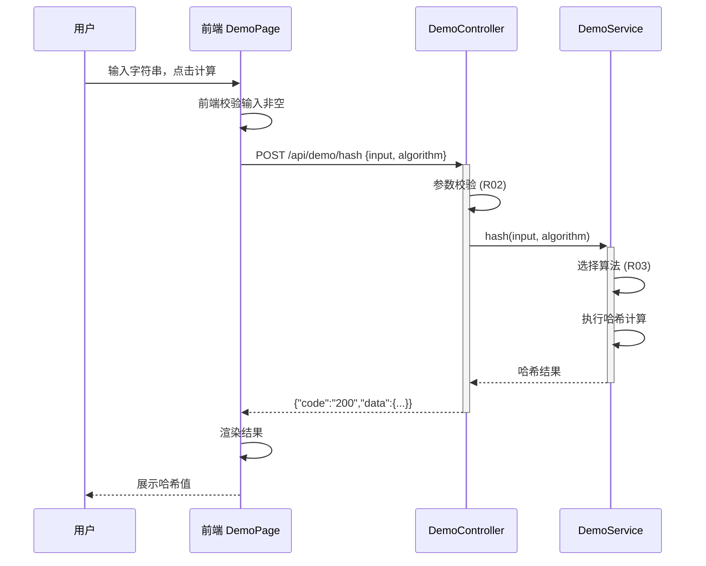
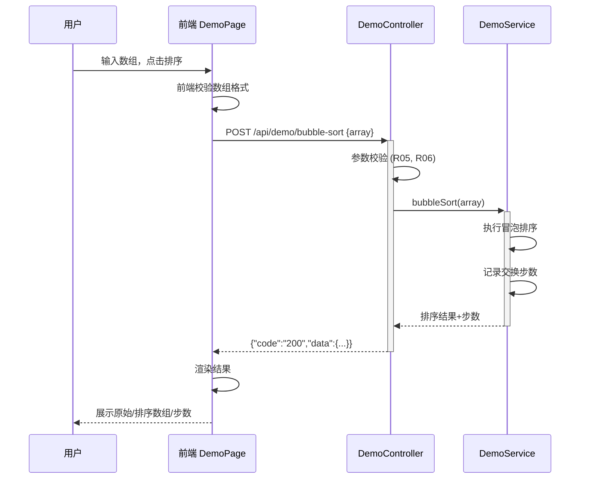
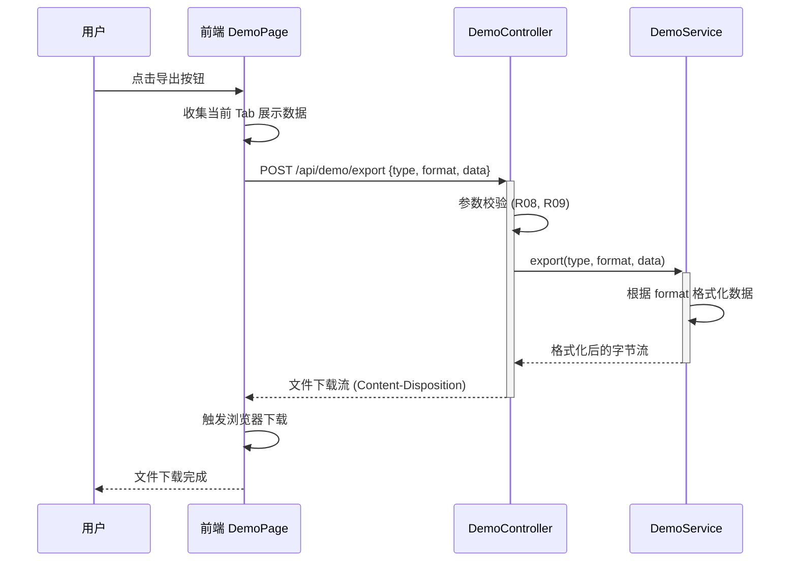

> **文档元信息**
>
> | 项目 | 内容 |
> |------|------|
> | 文档版本 | v1.0 |
> | 作者 | DTCoder |
> | 创建日期 | 2026-08-18 |
> | 需求来源 | 任务输入：分别写三个接口helloworld、哈希算法以及冒泡排序；前端新增一个页面，有三个tab分别展示不同的执行结果；新增导出按钮，后台提供导出接口 |
> | 评审状态 | 待评审 |

# Demo 工具集（三个接口 + 前端展示 + 导出）系分设计

## 1. 需求与范围

### 背景与目标
为 testDj（后端）/ testDJnew（前端）项目新增三个演示接口（helloworld、哈希算法、冒泡排序）及配套前端展示页面，并支持结果导出。目标是为项目提供一套可演示的基础工具集。

### 核心功能
1. 提供 helloworld 接口，返回问候语
2. 提供哈希算法接口，对输入字符串计算哈希值
3. 提供冒泡排序接口，对输入数组执行冒泡排序
4. 前端新增页面，以三个 Tab 分别展示三个接口的执行结果
5. 前端提供导出按钮，后端提供导出接口，支持导出各 Tab 的展示结果

### 约束与非功能要求
- 前后端分离架构（testDj 后端，testDJnew 前端）
- 导出格式默认 JSON/CSV
- 接口响应时间 < 500ms（非大批量场景）

### 排除范围
- 不考虑用户认证与权限（演示项目）
- 不考虑国际化
- 不考虑数据持久化（接口为无状态计算）

### 需求功能清单与优先级

| 编号 | 功能点 | 优先级 | PRD 原始描述/章节 | 备注 |
|------|--------|--------|-------------------|------|
| F01 | helloworld 接口 | P0 | "分别写三个接口helloworld" | 返回问候语 |
| F02 | 哈希算法接口 | P0 | "哈希算法" | 输入字符串，返回哈希值 |
| F03 | 冒泡排序接口 | P0 | "冒泡排序" | 输入数组，返回排序结果 |
| F04 | 前端三 Tab 展示页面 | P0 | "前端新增一个页面，有三个tab分别展示不同的执行结果" | 三个 Tab 对应三个接口 |
| F05 | 导出按钮 | P1 | "新增导出按钮" | 前端触发导出 |
| F06 | 后台导出接口 | P1 | "后台提供导出接口，支持导出各个页面的展示结果" | 后端支持导出各 Tab 结果 |

### 假设与待确认项

| 编号 | 假设/待确认内容 | 当前假设 | 确认状态 |
|------|-----------------|----------|----------|
| A01 | 后端技术栈 | Spring Boot（基于仓库名 dtazziboot） | 待确认 |
| A02 | 前端技术栈 | React | 待确认 |
| A03 | 导出格式 | JSON（默认），可选 CSV | 待确认 |
| A04 | 哈希算法 | SHA-256 | 待确认 |
| A05 | 排序输入格式 | JSON 数组，如 [5,3,8,1] | 待确认 |
| A06 | 前端路由 | /demo/tools | 待确认 |

## 2. 架构与模块

### 功能架构



- **交互层说明**：testDJnew 前端提供 Demo Tools 页面，含三个 Tab 和导出按钮
- **核心服务层说明**：testDj 后端提供 Demo 模块，包含四个 API

**模块清单**

| 模块 | 职责 | 依赖 |
|------|------|------|
| Demo 演示模块（testDj） | 提供 helloworld、哈希、排序、导出四个接口 | 无外部依赖 |
| Demo Tools 页面（testDJnew） | 前端三 Tab 展示 + 导出触发 | 依赖 Demo 模块 API |

### 应用集成架构



**集成关系说明：**

| 调用方 | 被调用方 | 协议 | 接口类型 | 说明 |
|--------|----------|------|----------|------|
| 用户浏览器 | testDJnew Demo 页面 | HTTPS | Web 前端 | 页面渲染与交互 |
| Demo 页面 | testDj DemoController | HTTPS | oneapi REST | Ajax 调用后端接口 |

### 部署架构



**部署说明：**
- **负载均衡层**：Nginx 反向代理，前端静态资源 + 后端 API 统一入口
- **应用层**：前端单实例部署静态资源，后端单实例（演示项目，无需多副本）
- **数据层**：无数据库依赖（纯计算服务）

## 3. 数据模型与存储

### 实体清单

本需求为无状态计算服务，不涉及持久化存储。无数据库实体。

| 实体名称 | 实体说明 | 所属模块 | 与其他实体的关系 |
|----------|----------|----------|-----------------|
| 本项不适用 | 三个接口均为纯计算（helloworld/哈希/排序），无持久化数据 | - | - |

### 实体关系图

本项不适用，原因：无数据库实体，无需实体关系图。

**模型说明：** 无。

## 4. 接口设计

### 4.1 oneapi（Web 控制台接口）

| 编号 | 接口名称 | 方法 | 路径 | 模块 |
|------|----------|------|------|------|
| W01 | HelloWorld | GET | /api/demo/hello | Demo 模块 |
| W02 | 哈希计算 | POST | /api/demo/hash | Demo 模块 |
| W03 | 冒泡排序 | POST | /api/demo/bubble-sort | Demo 模块 |
| W04 | 结果导出 | POST | /api/demo/export | Demo 模块 |

### 4.2 OpenAPI（对外接口）

本项不适用，原因：演示项目无需对外开放接口。

### 4.3 内部接口（Service 层）

| 编号 | 接口名称 | 类 | 方法签名 |
|------|----------|------|----------|
| S01 | HelloWorld 服务 | DemoService | String hello() |
| S02 | 哈希计算服务 | DemoService | String hash(String input, String algorithm) |
| S03 | 冒泡排序服务 | DemoService | int[] bubbleSort(int[] array) |
| S04 | 导出服务 | DemoService | byte[] export(String type, String format, Map data) |

### 4.4 集成接口（Integration 层）

本项不适用，原因：无外部系统集成。

## 5. 功能模块设计

### 全局约定

**错误码格式：** `DEMO_{SEQ}`（三位数字序号）

**通用出参结构：**
```json
{
  "code": "200",
  "msg": "SUCCESS",
  "data": {}
}
```

**错误码定义：**

| 错误码 | 说明 |
|--------|------|
| DEMO_001 | 参数校验失败 |
| DEMO_002 | 不支持的哈希算法 |
| DEMO_003 | 排序数组为空或格式错误 |
| DEMO_004 | 导出类型不支持 |
| DEMO_005 | 系统内部错误 |

**模块映射：**

| 模块 | 所属仓库 | Controller | Service |
|------|----------|------------|---------|
| Demo 模块 | testDj | DemoController | DemoService |

### 5.1 Demo 模块

#### 5.1.1 表结构设计

本模块为无状态计算服务，不涉及数据库表。

##### 5.1.1.x 枚举与常量定义

本模块无枚举/常量定义（纯计算，无业务状态）。

#### 5.1.2 接口详细设计

##### W01 HelloWorld

- **URI**: GET /api/demo/hello
- **描述**: 返回问候语
- **入参**: 无

- **出参**:

| 参数名称 | 类型 | 描述 |
|----------|------|------|
| code | String | 结果码 |
| msg | String | 提示信息 |
| data | Object | 业务数据 |
| data.message | String | 问候语，如 "Hello, World!" |

- **错误码**:

| 错误码 | 说明 |
|--------|------|
| DEMO_005 | 系统内部错误 |

- **业务规则**: 无特殊规则，直接返回固定问候语。

- **请求示例**:
```
GET /api/demo/hello
```

- **响应示例**:
```json
{
  "code": "200",
  "msg": "SUCCESS",
  "data": {
    "message": "Hello, World!"
  }
}
```

---

##### W02 哈希计算

- **URI**: POST /api/demo/hash
- **描述**: 对输入字符串计算哈希值，支持 SHA-256（默认）、MD5
- **入参**:

| 参数名称 | 类型 | 是否必填 | 描述 |
|----------|------|----------|------|
| input | String | 是 | 待哈希的原始字符串 |
| algorithm | String | 否 | 哈希算法，默认 SHA-256，可选 MD5 |

- **出参**:

| 参数名称 | 类型 | 描述 |
|----------|------|------|
| code | String | 结果码 |
| msg | String | 提示信息 |
| data | Object | 业务数据 |
| data.input | String | 原始输入 |
| data.algorithm | String | 使用的哈希算法 |
| data.hash | String | 哈希结果（十六进制字符串） |

- **错误码**:

| 错误码 | 说明 |
|--------|------|
| DEMO_001 | input 参数为空 |
| DEMO_002 | 不支持的哈希算法 |
| DEMO_005 | 系统内部错误 |

- **业务规则**:
  - 算法仅支持 SHA-256 和 MD5
  - 输入字符串长度不超过 10000 字符

- **请求示例**:
```json
{
  "input": "hello world",
  "algorithm": "SHA-256"
}
```

- **响应示例**:
```json
{
  "code": "200",
  "msg": "SUCCESS",
  "data": {
    "input": "hello world",
    "algorithm": "SHA-256",
    "hash": "b94d27b9934d3e08a52e52d7da7dabfac484efe37a5380ee9088f7ace2efcde9"
  }
}
```

---

##### W03 冒泡排序

- **URI**: POST /api/demo/bubble-sort
- **描述**: 对输入整数数组执行冒泡排序，返回排序结果及排序步骤
- **入参**:

| 参数名称 | 类型 | 是否必填 | 描述 |
|----------|------|----------|------|
| array | int[] | 是 | 待排序的整数数组 |

- **出参**:

| 参数名称 | 类型 | 描述 |
|----------|------|------|
| code | String | 结果码 |
| msg | String | 提示信息 |
| data | Object | 业务数据 |
| data.original | int[] | 原始数组 |
| data.sorted | int[] | 排序后数组 |
| data.steps | int | 排序步数（交换次数） |

- **错误码**:

| 错误码 | 说明 |
|--------|------|
| DEMO_001 | array 为空或格式错误 |
| DEMO_005 | 系统内部错误 |

- **业务规则**:
  - 数组长度不超过 1000
  - 数组元素为整数

- **请求示例**:
```json
{
  "array": [5, 3, 8, 1, 2]
}
```

- **响应示例**:
```json
{
  "code": "200",
  "msg": "SUCCESS",
  "data": {
    "original": [5, 3, 8, 1, 2],
    "sorted": [1, 2, 3, 5, 8],
    "steps": 7
  }
}
```

---

##### W04 结果导出

- **URI**: POST /api/demo/export
- **描述**: 导出指定类型的结果数据，支持 JSON 和 CSV 格式
- **入参**:

| 参数名称 | 类型 | 是否必填 | 描述 |
|----------|------|----------|------|
| type | String | 是 | 导出类型：hello / hash / sort |
| format | String | 否 | 导出格式：json（默认）/ csv |
| data | Object | 是 | 对应 Tab 的当前展示结果数据 |

- **出参**:

| 参数名称 | 类型 | 描述 |
|----------|------|------|
| 响应体 | binary | 文件下载流，Content-Type 根据 format 设置 |

- **错误码**:

| 错误码 | 说明 |
|--------|------|
| DEMO_001 | type 或 data 参数为空 |
| DEMO_004 | format 不支持 |
| DEMO_005 | 系统内部错误 |

- **业务规则**:
  - type 为 hello 时导出问候语文本
  - type 为 hash 时导出原始输入+算法+哈希值
  - type 为 sort 时导出原始数组+排序结果+步数
  - JSON 格式：Content-Type application/json
  - CSV 格式：Content-Type text/csv

- **请求示例**:
```json
{
  "type": "hash",
  "format": "json",
  "data": {
    "input": "hello world",
    "algorithm": "SHA-256",
    "hash": "b94d27b9..."
  }
}
```

- **响应示例** (JSON):
```json
{
  "type": "hash",
  "input": "hello world",
  "algorithm": "SHA-256",
  "hash": "b94d27b9934d3e08a52e52d7da7dabfac484efe37a5380ee9088f7ace2efcde9"
}
```

#### 5.1.3 子功能详细设计

##### 5.1.3.1 HelloWorld 接口调用（F01）

- 处理时序图



**业务规则：**

| 规则编号 | 规则描述 | 校验时机 | 不满足时的处理 |
|----------|----------|----------|--------------|
| R01 | 接口调用成功返回问候语 | 始终 | 返回 DEMO_005 |

**异常场景：**

| 异常场景 | 处理方式 |
|----------|----------|
| 后端服务不可达 | 前端展示"服务不可用，请稍后重试"提示 |

**并发控制：** 无并发风险，原因：只读操作，无数据写入。

---

##### 5.1.3.2 哈希计算接口调用（F02）

- 处理时序图



**业务规则：**

| 规则编号 | 规则描述 | 校验时机 | 不满足时的处理 |
|----------|----------|----------|--------------|
| R02 | input 不能为空 | 请求到达时 | 返回 DEMO_001，提示"输入不能为空" |
| R03 | algorithm 仅支持 SHA-256/MD5 | 计算前 | 返回 DEMO_002，提示"不支持的算法" |
| R04 | 输入长度 ≤ 10000 | 计算前 | 返回 DEMO_001，提示"输入过长" |

**异常场景：**

| 异常场景 | 处理方式 |
|----------|----------|
| 不支持的算法 | 返回 DEMO_002 |
| 输入为空 | 返回 DEMO_001 |
| 后端服务不可达 | 前端展示"服务不可用"提示 |

**并发控制：** 无并发风险，原因：无状态计算，每次请求独立。

---

##### 5.1.3.3 冒泡排序接口调用（F03）

- 处理时序图



**业务规则：**

| 规则编号 | 规则描述 | 校验时机 | 不满足时的处理 |
|----------|----------|----------|--------------|
| R05 | array 不能为空 | 请求到达时 | 返回 DEMO_001，提示"数组不能为空" |
| R06 | array 长度 ≤ 1000 | 计算前 | 返回 DEMO_001，提示"数组过长" |
| R07 | array 元素必须为整数 | 计算前 | 返回 DEMO_001，提示"数组元素须为整数" |

**异常场景：**

| 异常场景 | 处理方式 |
|----------|----------|
| 数组为空或格式错误 | 返回 DEMO_001 |
| 数组过长 | 返回 DEMO_001 |
| 后端服务不可达 | 前端展示"服务不可用"提示 |

**并发控制：** 无并发风险，原因：无状态计算，每次请求独立。

---

##### 5.1.3.4 导出功能（F05、F06）

- 处理时序图



**业务规则：**

| 规则编号 | 规则描述 | 校验时机 | 不满足时的处理 |
|----------|----------|----------|--------------|
| R08 | type 必须为 hello/hash/sort 之一 | 请求到达时 | 返回 DEMO_001，提示"导出类型无效" |
| R09 | format 仅支持 json/csv | 请求到达时 | 返回 DEMO_004，提示"不支持的导出格式" |
| R10 | data 不能为空 | 请求到达时 | 返回 DEMO_001，提示"数据不能为空" |

**异常场景：**

| 异常场景 | 处理方式 |
|----------|----------|
| 不支持的导出格式 | 返回 DEMO_004 |
| 数据为空 | 返回 DEMO_001 |
| 后端服务不可达 | 前端展示"导出失败，请重试"提示 |

**并发控制：** 无并发风险，原因：每次导出为独立请求，无共享状态。

---

#### 5.1.4 技术选型方案对比

| 方案 | 描述 | 优点 | 缺点 | 推荐 |
|------|------|------|------|------|
| 方案A: 纯后端计算 | 所有计算逻辑在后端 Service 层完成 | 前端轻量，逻辑集中 | 无 | ✅ 推荐 |
| 方案B: 前端计算 | 哈希和排序在前端 JS 完成 | 减少后端请求 | 一致性差，无法复用 | 不推荐 |

**推荐方案A**，理由：前后端职责清晰，后端接口可复用，符合传统 B/S 架构。

## 6. 非功能性需求设计

### 6.1 高可用性

- 本服务为演示项目，单实例部署即可满足需求
- 下游依赖：无外部依赖，服务自身无降级需求
- 前端加载失败时展示友好错误提示

### 6.2 可扩展性

- 接口设计遵循 RESTful 规范，后续可扩展更多算法接口
- 哈希算法支持通过 parameter 扩展（如增加 SHA-512）
- 排序算法可扩展为策略模式，支持多种排序算法切换
- 导出格式可通过 format 参数扩展

### 6.3 稳定性/可靠性

- 输入校验：所有接口入参在前端和后端均做校验，防止非法输入
- 输入长度限制：哈希输入 ≤ 10000 字符，排序数组 ≤ 1000 元素
- 无状态设计：每次请求独立，无累计错误

### 6.4 安全性设计

#### 6.4.1 账户系统方案

本项不适用，原因：演示项目无需用户认证。

#### 6.4.2 授权&访问控制

##### 6.4.2.1 是否实现水平权限检查

本项不适用，原因：不涉及数据库查询、公共数据查询。

##### 6.4.2.2 是否实现垂直权限检查

本项不适用，原因：不涉及数据库查询或为公共数据查询。

##### 6.4.2.3 是否检查登录态

本项不适用，原因：演示项目为公开接口。如有需要，可后续添加全局统一拦截器。

#### 6.4.3 数据防护方案

##### 6.4.3.1 是否对敏感数据加密存储

本项不适用，原因：不涉及敏感数据存储。

##### 6.4.3.2 是否对敏感数据展示进行脱敏

本项不适用，原因：不涉及敏感数据展示。

### 6.5 监控/统计/日志/告警

- 接口调用日志：记录请求路径、参数、耗时、响应码
- 异常日志：记录异常堆栈，便于排查

## 7. 变更三板斧

### 7.1 可监控

| 监控埋点 | 埋点位置 | 监控指标 | 说明 |
|----------|----------|----------|------|
| 接口调用量 | DemoController 各接口 | 调用次数/分钟 | 每个接口独立统计 |
| 接口耗时 | DemoController 各接口 | P50/P99 耗时 | 超过 500ms 告警 |
| 接口错误率 | DemoController 各接口 | 错误次数/分钟 | 非 200 响应 |
| 导出请求量 | Export API | 调用次数/分钟 | 统计导出频率 |

### 7.2 可灰度

本项不适用，原因：演示项目用户量小，无需灰度发布。可直接全量上线。

### 7.3 可应急

- **回滚方案**：发布包回滚至上一版本即可，无数据库变更，无兼容性风险
- **开关控制**：建议在 DemoController 添加 `@ConditionalOnProperty` 开关，可通过配置 `demo.enabled=true/false` 快速关闭所有 Demo 接口
- **上下游影响**：纯前端+后端独立服务，回滚无上下游兼容性问题