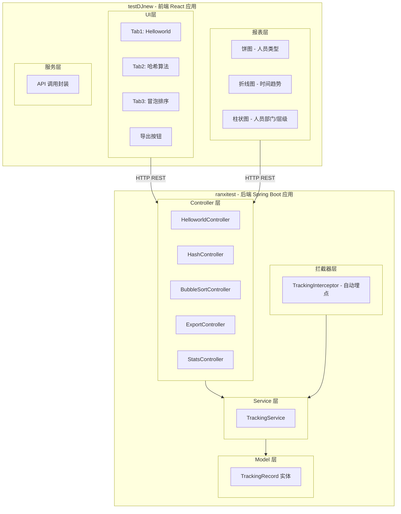
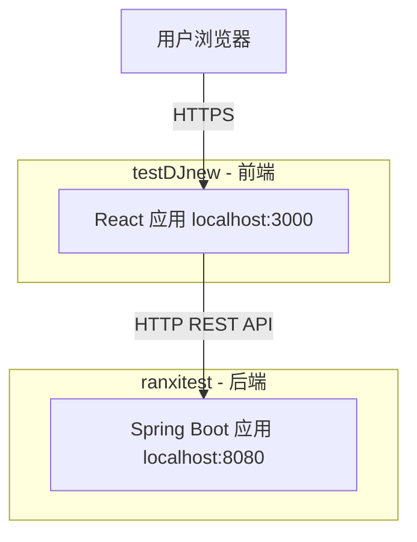
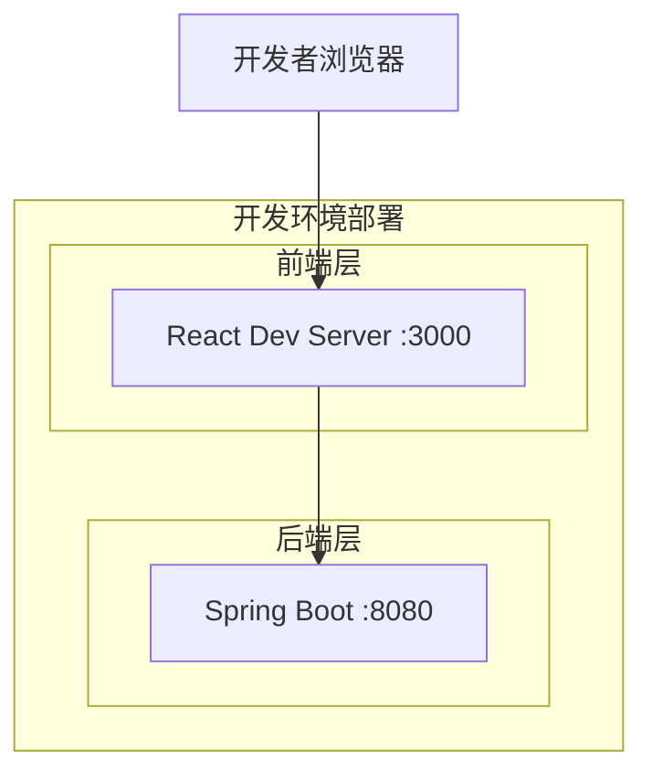
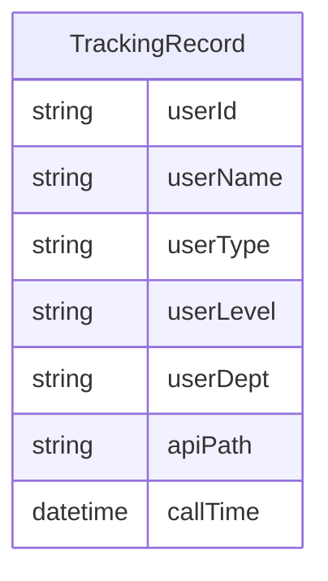
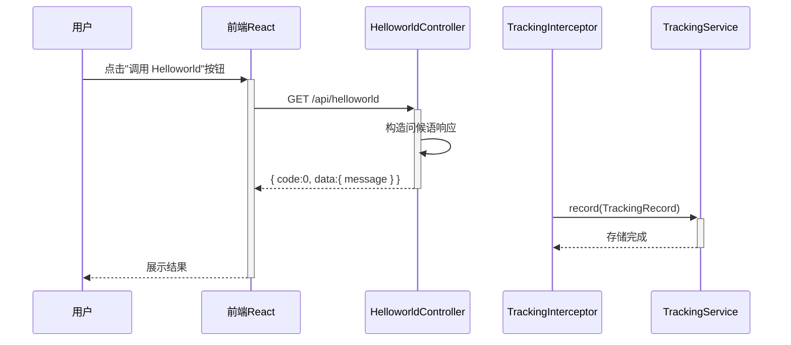
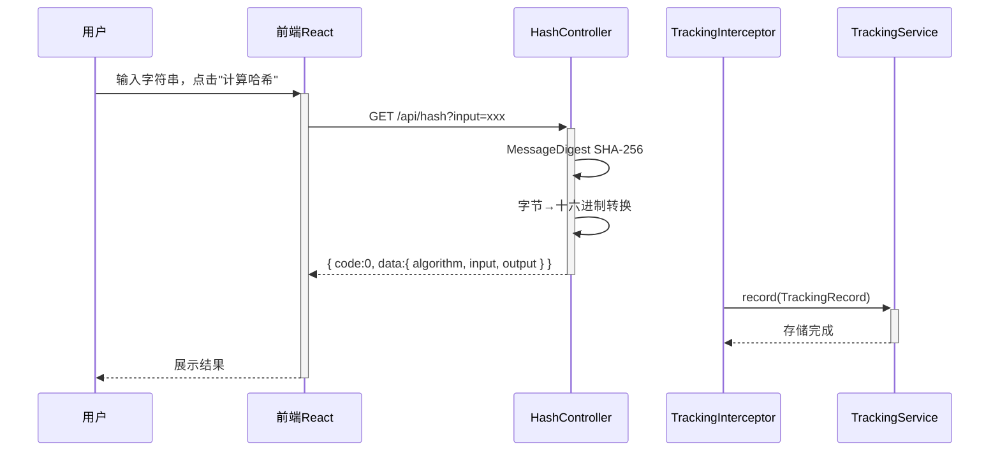
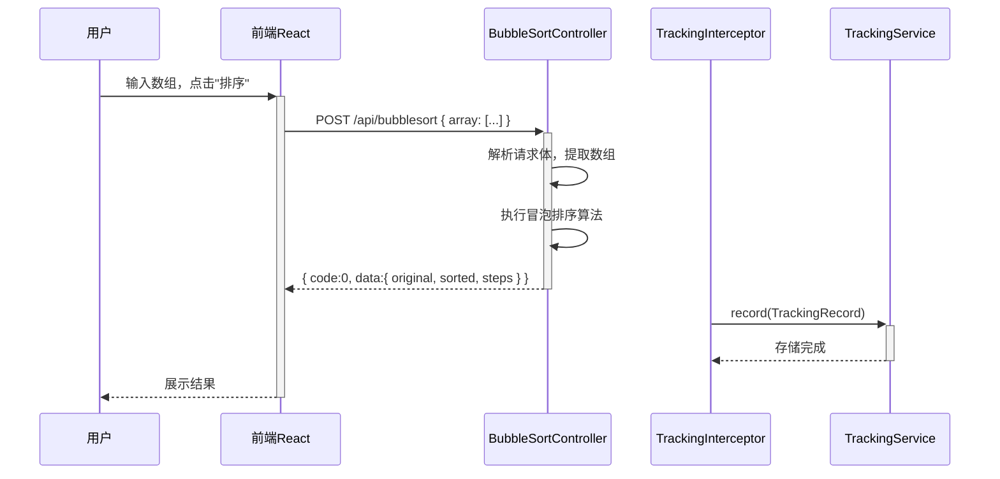
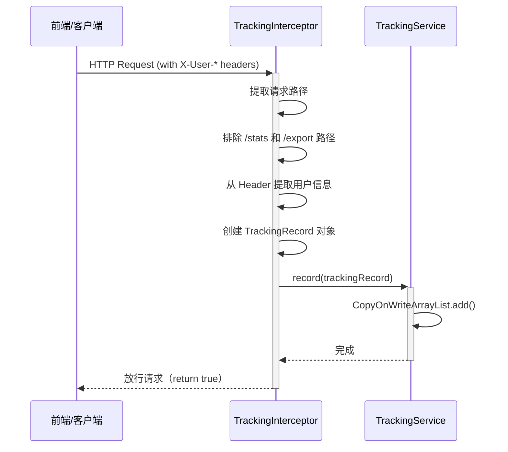
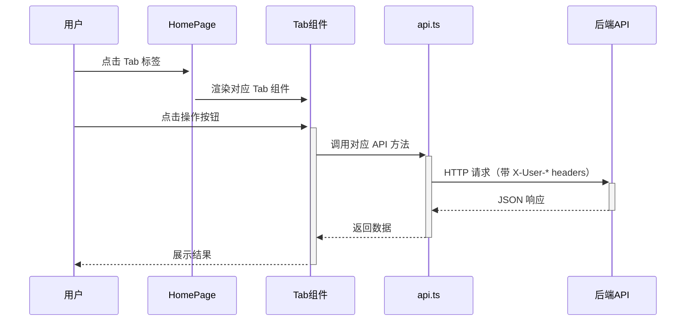
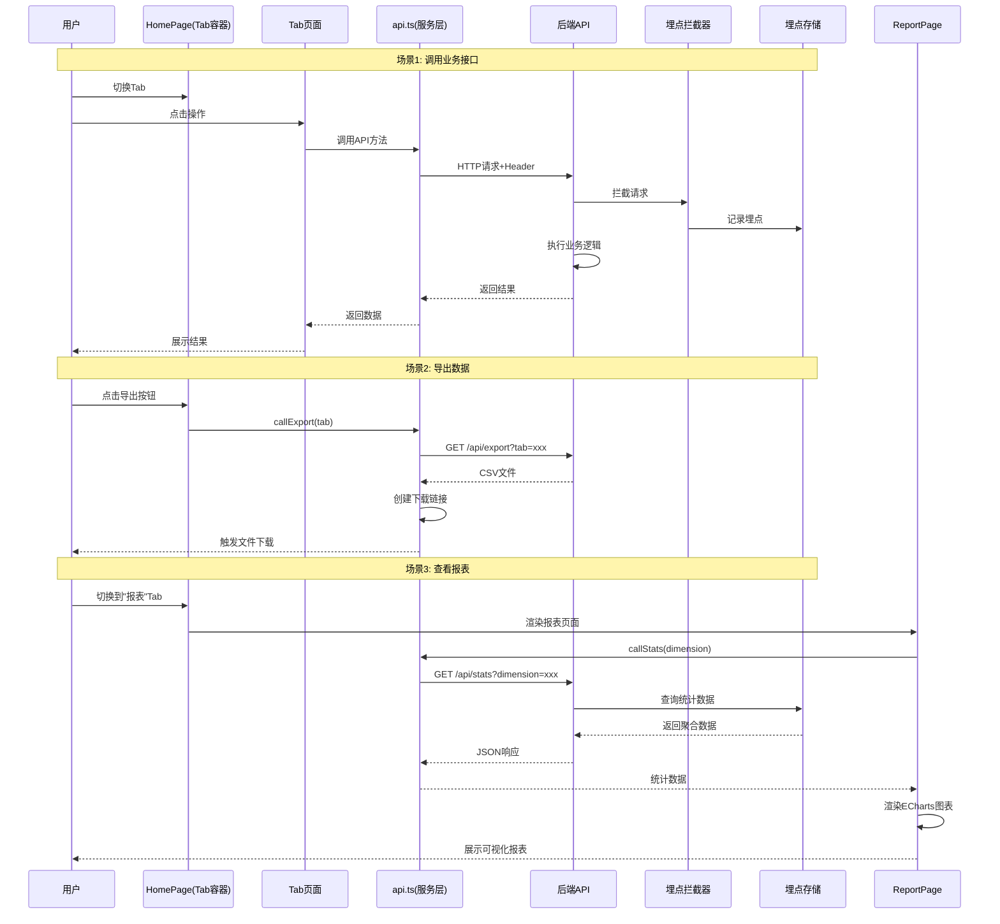

> **文档元信息**
>
> | 项目 | 内容 |
> |------|------|
> | 文档版本 | v1.0 |
> | 作者 | DTCoder |
> | 创建日期 | 2026-08-24 |
> | 需求来源 | .agents/20260824-分别写三个接口helloworld_哈希/dima.md |
> | 评审状态 | 待评审 |

# 三接口（Helloworld / 哈希 / 冒泡排序）+ 前端 Tab 页 + 可视化报表 系分设计

## 1. 需求与范围

### 背景与目标
在 testDJnew（前端 React）和 ranxitest（后端 Java Spring Boot）两个仓库中，实现三个后端接口（helloworld、哈希算法、冒泡排序）、前端三 Tab 页面、导出功能、埋点统计及可视化报表。

### 核心功能
1. 后端提供三个业务接口：helloworld、哈希算法（SHA-256）、冒泡排序
2. 前端新增页面，三个 Tab 分别展示不同接口的执行结果
3. 导出按钮 + 后台导出接口（CSV 格式），支持导出各 Tab 页面数据
4. 后端埋点：记录调用次数、调用人（通过 HTTP Header 模拟）、调用时间、人员维度
5. 前端可视化报表：折线图（时间趋势）、饼图（人员类型）、柱状图（人员部门/层级）

### 约束与非功能要求
- 前后端分离架构，前端通过 HTTP 调用后端 REST API
- 统一响应格式：`{ code: 0, data: { ... } }`
- 哈希算法使用 SHA-256
- 导出格式为 CSV
- 埋点存储为内存存储（应用重启重置）
- 调用人识别通过 HTTP Header 模拟：X-User-Id, X-User-Name, X-User-Type, X-User-Level, X-User-Dept
- 两个仓库均为空仓，需从零搭建项目骨架

### 排除范围
- 不涉及用户认证/登录系统
- 不涉及持久化数据库
- 不涉及文件存储
- 不涉及消息队列
- 不涉及分布式部署

### 需求功能清单与优先级

| 编号 | 功能点 | 优先级 | 原始描述 | 备注 |
|------|--------|--------|----------|------|
| F01 | Helloworld 接口 | P0 | "分别写三个接口helloworld" | GET /api/helloworld，返回问候语 |
| F02 | 哈希算法接口 | P0 | "哈希算法" | GET /api/hash?input=xxx，SHA-256 |
| F03 | 冒泡排序接口 | P0 | "冒泡排序" | POST /api/bubblesort，对数组排序 |
| F04 | 前端三 Tab 页面 | P0 | "前端新增一个页面，有三个tab分别展示不同的执行结果" | Tab1: helloworld, Tab2: 哈希, Tab3: 冒泡排序 |
| F05 | 导出按钮 + 导出接口 | P1 | "新增导出按钮，后台提供导出接口，支持导出各个页面的展示结果" | CSV 格式导出 |
| F06 | 后端埋点系统 | P0 | "后端再做个埋点，获取调用次数和调用人" | 拦截器自动记录 + 维度信息 |
| F07 | 可视化报表 | P1 | "前端可视化出来一个报表查看调用情况...折线图以及饼图和柱状图" | 三种图表展示不同维度 |

### 假设与待确认项

| 编号 | 假设/待确认内容 | 当前假设 | 确认状态 |
|------|-----------------|----------|----------|
| A01 | 人员维度信息通过 HTTP Header 模拟传递 | 前端请求头携带 X-User-* 模拟用户信息 | 已确认 |
| A02 | 埋点存储在内存中，重启后重置 | 使用 CopyOnWriteArrayList 存储 | 已确认 |
| A03 | 导出格式为 CSV | 纯文本 CSV 格式 | 已确认 |
| A04 | 前端端口为 3000，后端端口为 8080 | 开发环境默认配置 | 待确认 |
| A05 | 人员维度枚举值由前端在请求头中指定 | developer/manager/admin, junior/mid/senior/lead, engineering/product/design/marketing | 待确认 |

## 2. 架构与模块

### 功能架构



**模块清单**

| 模块 | 仓库 | 职责 | 依赖 |
|------|------|------|------|
| 业务接口模块 | ranxitest | 提供 helloworld/哈希/冒泡排序三个 REST 接口 | 无 |
| 埋点模块 | ranxitest | 自动记录每次 API 调用的调用人、时间、维度信息 | 无 |
| 导出模块 | ranxitest | 按 Tab 维度导出 CSV 文件 | 埋点模块 |
| 统计模块 | ranxitest | 按维度聚合统计埋点数据 | 埋点模块 |
| Tab 页面模块 | testDJnew | 三个 Tab 分别展示各接口调用结果 | 业务接口模块 |
| 报表模块 | testDJnew | 折线图/饼图/柱状图展示调用统计 | 统计模块 |
| 导出按钮模块 | testDJnew | 触发导出功能 | 导出模块 |

### 应用集成架构



**集成关系说明：**

| 调用方 | 被调用方 | 协议 | 接口类型 | 说明 |
|--------|----------|------|----------|------|
| 前端 React 应用 | 后端 Spring Boot | HTTP | REST API | 通过 axios 调用后端接口 |
| 后端拦截器 | 后端内存存储 | JVM | 方法调用 | 自动记录埋点数据 |

### 部署架构



**部署说明：**
- **前端层**：React 开发服务器，端口 3000，通过 `react-scripts start` 启动
- **后端层**：Spring Boot 内嵌 Tomcat，端口 8080，通过 `mvn spring-boot:run` 启动
- 前后端通过 HTTP 通信，后端配置 CORS 允许来自 `http://localhost:3000` 的跨域请求

## 3. 数据模型与存储

### 实体清单

| 实体名称 | 实体说明 | 所属模块 | 与其他实体的关系 |
|----------|----------|----------|-----------------|
| TrackingRecord | 埋点记录，记录每次 API 调用的详细信息 | 埋点模块 | 无（独立实体） |

### 实体关系图



**模型说明：**
- TrackingRecord 为独立实体，不与其他实体关联
- 所有数据存储在内存中（CopyOnWriteArrayList），应用重启后重置
- 无需数据库表、无需持久化存储

**存储方案技术选型：**

| 方案 | 优点 | 缺点 |
|------|------|------|
| 方案A：内存存储（CopyOnWriteArrayList） | 实现简单，无需外部依赖，读写性能高 | 重启丢失，数据量受限于内存 |
| 方案B：嵌入式数据库（H2） | 持久化，可查询 | 需要额外依赖，文件管理 |
| 方案C：MySQL | 功能完善，可持久化 | 需要额外部署数据库服务 |

**推荐方案：** 方案A（内存存储）
**推荐理由：** 当前需求为演示/原型级别，无持久化要求，内存存储能满足需求且实现最简单。

## 4. 接口设计

### 4.1 oneapi（Web 控制台接口）

| 编号 | 接口名称 | 方法 | 路径 | 所属模块 |
|------|----------|------|------|----------|
| W01 | Helloworld | GET | /api/helloworld | 业务接口模块 |
| W02 | 哈希算法 | GET | /api/hash?input=xxx | 业务接口模块 |
| W03 | 冒泡排序 | POST | /api/bubblesort | 业务接口模块 |
| W04 | 导出数据 | GET | /api/export?tab=xxx | 导出模块 |
| W05 | 调用统计 | GET | /api/stats?dimension=xxx | 统计模块 |

### 4.2 OpenAPI（对外接口）

本项不适用，原因：该系统为前端演示应用，不对外部系统开放 API。

### 4.3 内部接口（Service 层）

| 编号 | 接口名称 | 类 | 方法签名 |
|------|----------|------|----------|
| S01 | 记录埋点 | TrackingService | record(TrackingRecord) |
| S02 | 获取所有埋点记录 | TrackingService | getAllRecords() → List\<TrackingRecord\> |
| S03 | 按维度统计 | TrackingService | getStatsByDimension(String dimension) → List\<Map\> |
| S04 | 按时间维度统计 | TrackingService | getTimeSeriesStats() → List\<Map\> |

### 4.4 集成接口（Integration 层）

本项不适用，原因：该系统不涉及外部系统集成。

## 5. 功能模块设计

### 全局约定

- **错误码格式**：{MODULE}_{SEQ}，模块前缀：BIZ（业务接口）、TRK（埋点）、EXP（导出）、STA（统计）
- **通用出参结构**：`{ "code": 0, "data": { ... } }`

### 5.1 业务接口模块（ranxitest）

#### 5.1.1 接口详细设计

##### W01 Helloworld 接口

- **URI**: GET /api/helloworld
- **描述**: 返回问候语
- **入参**: 无

- **出参**:

| 参数名称 | 类型 | 描述 |
|----------|------|------|
| code | Integer | 结果码，0 表示成功 |
| data | Object | 业务数据 |
| data.message | String | 问候语内容 |

- **错误码**: 无（固定返回成功）

- **响应示例**:
```json
{
  "code": 0,
  "data": {
    "message": "Hello, World!"
  }
}
```

##### W02 哈希算法接口

- **URI**: GET /api/hash?input=hello
- **描述**: 对输入字符串进行 SHA-256 哈希计算
- **入参**:

| 参数名称 | 类型 | 是否必填 | 描述 |
|----------|------|----------|------|
| input | String | 否 | 要哈希的字符串，默认值 "hello" |

- **出参**:

| 参数名称 | 类型 | 描述 |
|----------|------|------|
| code | Integer | 结果码，0 表示成功 |
| data | Object | 业务数据 |
| data.algorithm | String | 哈希算法名称，固定 "sha256" |
| data.input | String | 原始输入字符串 |
| data.output | String | 哈希后的十六进制字符串 |

- **错误码**:

| 错误码 | 说明 |
|--------|------|
| 0 | 成功 |
| BIZ_001 | SHA-256 算法不可用 |

- **响应示例**:
```json
{
  "code": 0,
  "data": {
    "algorithm": "sha256",
    "input": "hello",
    "output": "2cf24dba5fb0a30e26e83b2ac5b9e29e1b161e5c1fa7425e73043362938b9824"
  }
}
```

##### W03 冒泡排序接口

- **URI**: POST /api/bubblesort
- **描述**: 对输入数组执行冒泡排序
- **入参**:

| 参数名称 | 类型 | 是否必填 | 描述 |
|----------|------|----------|------|
| array | Integer[] | 是 | 待排序的整数数组 |

- **出参**:

| 参数名称 | 类型 | 描述 |
|----------|------|------|
| code | Integer | 结果码，0 表示成功 |
| data | Object | 业务数据 |
| data.original | Integer[] | 原始数组 |
| data.sorted | Integer[] | 排序后的数组 |
| data.steps | Integer | 交换次数 |

- **错误码**:

| 错误码 | 说明 |
|--------|------|
| 0 | 成功 |
| BIZ_002 | 请求参数缺失或格式错误 |

- **请求示例**:
```json
{
  "array": [5, 3, 8, 1, 2]
}
```

- **响应示例**:
```json
{
  "code": 0,
  "data": {
    "original": [5, 3, 8, 1, 2],
    "sorted": [1, 2, 3, 5, 8],
    "steps": 4
  }
}
```

#### 5.1.2 子功能详细设计

##### 5.1.2.1 Helloworld 调用（F01）

**处理时序图：**


**业务规则：**
| 规则编号 | 规则描述 | 校验时机 | 不满足时的处理 |
|----------|----------|----------|--------------|
| R01 | 接口无参数校验，直接返回固定问候语 | 始终 | 不适用 |

**异常场景：**
| 异常场景 | 处理方式 |
|----------|----------|
| 无异常 | 请求始终返回成功 |

**并发控制：** 无并发风险（只读接口）

##### 5.1.2.2 哈希算法调用（F02）

**处理时序图：**


**业务规则：**
| 规则编号 | 规则描述 | 校验时机 | 不满足时的处理 |
|----------|----------|----------|--------------|
| R02 | 使用标准 Java MessageDigest SHA-256 实现 | 始终 | 返回 BIZ_001 错误码 |

**异常场景：**
| 异常场景 | 处理方式 |
|----------|----------|
| SHA-256 算法不可用（JVM 环境异常） | 返回 data.output = "error: SHA-256 not available" |

**并发控制：** 无并发风险（只读接口）

##### 5.1.2.3 冒泡排序调用（F03）

**处理时序图：**


**业务规则：**
| 规则编号 | 规则描述 | 校验时机 | 不满足时的处理 |
|----------|----------|----------|--------------|
| R03 | 输入必须为整数数组 | 请求处理时 | 返回空数组 |

**异常场景：**
| 异常场景 | 处理方式 |
|----------|----------|
| 请求体缺少 array 字段 | 返回空数组，steps=0 |
| array 中包含非数字元素 | 自动跳过非数字元素 |

**并发控制：** 无并发风险（只读接口）

### 5.2 埋点模块（ranxitest）

#### 5.2.1 枚举与常量定义

| 维度 | Header 名称 | 可选值示例 |
|------|-------------|-----------|
| 人员类型 | X-User-Type | developer, manager, admin, tester |
| 人员层级 | X-User-Level | junior, mid, senior, lead |
| 人员部门 | X-User-Dept | engineering, product, design, marketing |

#### 5.2.2 接口详细设计

##### S01 记录埋点

- **方法签名**: TrackingService.record(TrackingRecord record)
- **描述**: 将一条埋点记录存入内存列表
- **入参**: record（TrackingRecord 对象）

##### S02 获取所有埋点记录

- **方法签名**: TrackingService.getAllRecords() → List\<TrackingRecord\>
- **描述**: 返回当前所有埋点记录的副本列表

##### S03 按维度统计

- **方法签名**: TrackingService.getStatsByDimension(String dimension) → List\<Map\<String, Object\>\>
- **描述**: 按指定维度（userType/userLevel/userDept）分组统计调用次数

##### S04 按时间维度统计

- **方法签名**: TrackingService.getTimeSeriesStats() → List\<Map\<String, Object\>\>
- **描述**: 按小时分组统计调用次数，按时间排序

#### 5.2.3 子功能详细设计

##### 5.2.3.1 自动埋点拦截（F06）

**处理时序图：**


**业务规则：**
| 规则编号 | 规则描述 | 校验时机 | 不满足时的处理 |
|----------|----------|----------|--------------|
| R04 | 仅拦截 /api/ 路径下的请求 | preHandle | 非 /api/ 路径直接放行 |
| R05 | 排除 /api/stats 和 /api/export 路径 | preHandle | 不记录埋点，直接放行 |
| R06 | Header 缺失时使用默认值 | preHandle | 使用默认值填充 |

**异常场景：**
| 异常场景 | 处理方式 |
|----------|----------|
| Header 缺失 | 使用默认值 anonymous/unknown 填充 |
| 请求路径为空 | 记录空字符串 |

**并发控制：**
- 并发场景：多线程并发写入埋点记录
- 控制策略：使用 CopyOnWriteArrayList 保证线程安全

### 5.3 导出模块（ranxitest）

#### 5.3.1 接口详细设计

##### W04 导出数据接口

- **URI**: GET /api/export?tab=helloworld
- **描述**: 按 Tab 维度导出埋点数据的 CSV 文件
- **入参**:

| 参数名称 | 类型 | 是否必填 | 描述 |
|----------|------|----------|------|
| tab | String | 否 | 导出类型：helloworld/hash/bubblesort，默认 helloworld |

- **出参**: CSV 文件（Content-Disposition: attachment）
- **CSV 格式**:
```csv
userId,userName,userType,userLevel,userDept,apiPath,callTime
user001,TestUser,developer,senior,engineering,/api/helloworld,2026-08-24T10:00:00
```

**业务规则：**
| 规则编号 | 规则描述 | 校验时机 | 不满足时的处理 |
|----------|----------|----------|--------------|
| R07 | 按 tab 参数筛选对应 API 路径的记录 | 导出时 | 空文件 |
| R08 | 文件名为 {tab}_data.csv | 导出时 | 固定格式 |

**异常场景：**
| 异常场景 | 处理方式 |
|----------|----------|
| 无埋点记录 | 返回只有表头的空 CSV 文件 |

### 5.4 统计模块（ranxitest）

#### 5.4.1 接口详细设计

##### W05 调用统计接口

- **URI**: GET /api/stats?dimension=userType
- **描述**: 按维度返回埋点统计数据和时序数据
- **入参**:

| 参数名称 | 类型 | 是否必填 | 描述 |
|----------|------|----------|------|
| dimension | String | 否 | 统计维度：userType/userLevel/userDept，默认 userType |

- **出参**:

| 参数名称 | 类型 | 描述 |
|----------|------|------|
| code | Integer | 结果码，0 表示成功 |
| data | Object | 业务数据 |
| data.dimension | String | 当前统计维度 |
| data.series | Array | 按维度分组统计结果 [{name, value}] |
| data.timeSeries | Array | 按时间维度统计结果 [{time, count}] |

- **响应示例**:
```json
{
  "code": 0,
  "data": {
    "dimension": "userType",
    "series": [
      { "name": "developer", "value": 5 },
      { "name": "manager", "value": 3 }
    ],
    "timeSeries": [
      { "time": "2026-08-24 10:00", "count": 3 },
      { "time": "2026-08-24 11:00", "count": 5 }
    ]
  }
}
```

### 5.5 前端 Tab 页面模块（testDJnew）

#### 5.5.1 接口详细设计

| 方法 | 后端路径 |
|------|----------|
| callHelloworld() | GET /api/helloworld |
| callHash(input) | GET /api/hash?input=xxx |
| callBubbleSort(array) | POST /api/bubblesort |
| callExport(tab) | GET /api/export?tab=xxx |
| callStats(dimension) | GET /api/stats?dimension=xxx |

#### 5.5.2 子功能详细设计

**组件结构：**
- HomePage：Tab 容器，管理 Tab 切换和导出按钮
- TabHelloworld：调用 /api/helloworld 并展示结果
- TabHash：输入字符串，调用 /api/hash 并展示结果
- TabBubbleSort：输入数组，调用 /api/bubblesort 并展示结果

**处理时序图：**


### 5.6 前端报表模块（testDJnew）

**技术选型方案对比：**

| 方案 | 优点 | 缺点 |
|------|------|------|
| 方案A：ECharts | 功能全面，图表类型丰富，React 生态完善（echarts-for-react） | 包体积较大 |
| 方案B：Chart.js | 轻量级，API 简洁 | 图表类型不如 ECharts 丰富 |

**推荐方案：** 方案A（ECharts）
**推荐理由：** ECharts 原生支持折线图、饼图、柱状图，且有成熟的 React 封装库。

**图表映射：**

| 图表类型 | 数据维度 | 数据来源 |
|----------|----------|----------|
| 折线图 | 时间趋势（timeSeries） | stats.timeSeries[].time / .count |
| 饼图 | 人员类型/层级/部门（series） | stats.series[].name / .value |
| 柱状图 | 人员类型/层级/部门（series） | stats.series[].name / .value |

**维度选择交互：** 用户通过下拉选择器切换维度（userType/userLevel/userDept），切换后重新调用 /api/stats?dimension=xxx 获取数据，饼图和柱状图联动更新。

**布局方案：** 折线图（左上）+ 饼图（右上）+ 柱状图（底部通栏）

### 5.7 跨模块时序图



## 6. 非功能性需求设计

### 6.1 高可用性
本项不适用，原因：本系统为单机开发/演示应用，不涉及生产高可用场景。后端为单实例 Spring Boot 应用，无集群部署要求。

### 6.2 可扩展性
- 后端接口按 Controller 分离，新增接口只需新增 Controller 类
- 埋点存储当前为内存存储，如需扩展可替换为数据库实现，只需修改 TrackingService 实现类
- 前端组件化设计，新增 Tab 页面只需新增组件并在 HomePage 中注册

### 6.3 稳定性/可靠性
- 后端参数校验：哈希接口和冒泡排序接口对输入参数做了基本校验和默认值处理
- 异常兜底：所有接口异常不会导致服务崩溃，返回友好的错误信息
- 埋点存储使用 CopyOnWriteArrayList，保证并发写入不丢失数据

### 6.4 安全性设计

#### 6.4.1 账户系统方案
本项不适用，原因：本系统为演示应用，不涉及用户登录/注册，用户信息通过 HTTP Header 模拟。

#### 6.4.2 授权&访问控制
本项不适用，原因：本系统为演示应用，不涉及权限控制，所有接口对外开放。

#### 6.4.3 数据防护方案
本项不适用，原因：本系统不涉及敏感数据存储。埋点数据仅包含用户模拟信息，无真实敏感数据。

### 6.5 监控/统计/日志/告警
- 埋点系统本身即为监控统计的实现，记录每次 API 调用的详细信息
- 日志：Spring Boot 默认日志框架记录应用运行日志
- 告警：本项不适用，原因：演示应用无需告警配置

## 7. 变更三板斧

### 7.1 可监控
- 埋点系统自动记录每次 API 调用的用户信息、时间、路径，提供实时监控数据
- 提供 /api/stats 接口，支持按不同维度查询调用统计
- 提供 /api/export 接口，支持导出埋点数据用于离线分析
- 监控数据可通过前端可视化报表实时查看

### 7.2 可灰度
本项不适用，原因：本系统为单机演示应用，无多租户/灰度发布需求。所有功能为一次性上线，不分阶段灰度。

### 7.3 可应急
- 后端服务重启即可重置所有状态（埋点数据重置为初始状态）
- 前端为静态页面，无状态管理，刷新即可恢复
- 所有接口无副作用（幂等），不会因重复调用导致数据不一致
- 回滚方案：如出现严重问题，通过 Git 回滚代码后重新部署即可