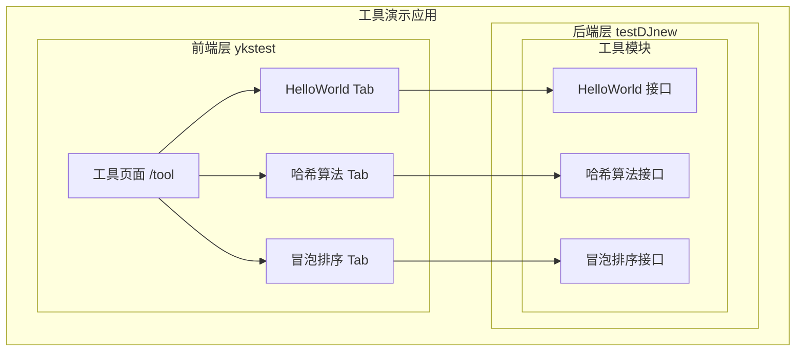
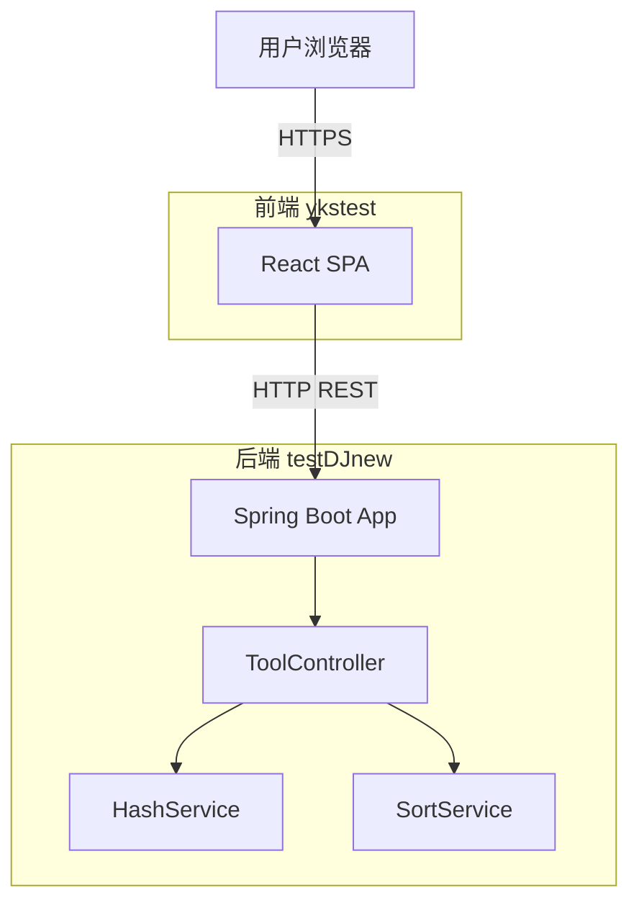
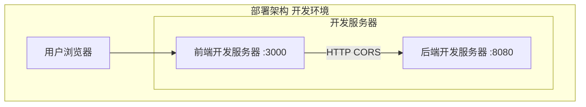
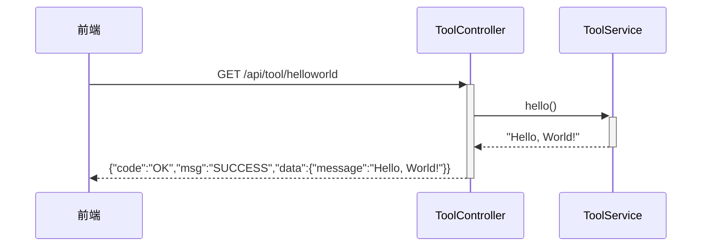
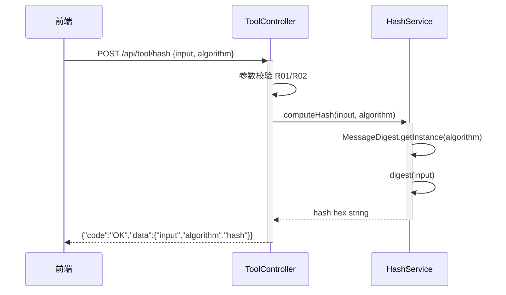
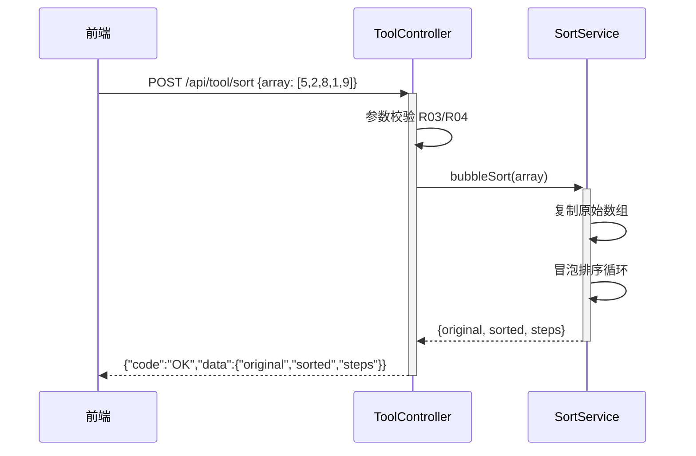
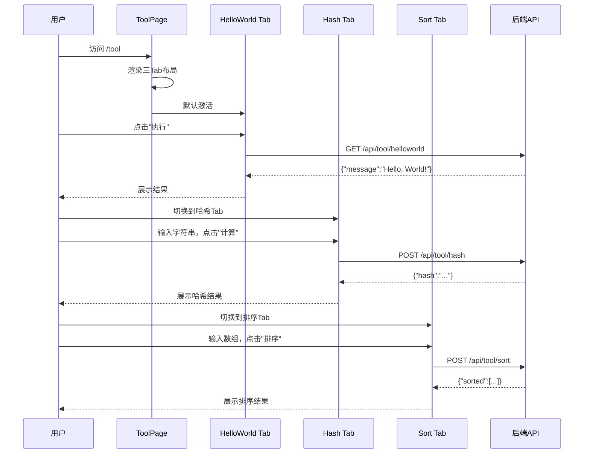

> **文档元信息**
>
> | 项目 | 内容 |
> |------|------|
> | 文档版本 | v1.0 |
> | 作者 | DTCoder |
> | 创建日期 | 2026-08-25 |
> | 需求来源 | 用户口头需求：三个接口（helloworld、哈希算法、冒泡排序）+ 前端三Tab页面 |
> | 评审状态 | 待评审 |

# 工具演示应用（三个接口 + 三Tab页面）系分设计

## 1. 需求与范围

### 背景与目标
在 testDJnew 和 ykstest 两个新建仓库中构建一个演示级工具应用：后端提供三个算法/工具接口，前端提供统一页面以 Tab 切换方式展示各接口执行结果。

### 核心功能
1. **HelloWorld 接口**：返回问候语字符串
2. **哈希算法接口**：对输入字符串计算哈希值（默认 SHA-256）
3. **冒泡排序接口**：对输入整数数组执行冒泡排序，返回排序结果
4. **前端展示页**：包含三个 Tab（HelloWorld / 哈希算法 / 冒泡排序），每个 Tab 内可触发对应接口调用并展示结果

### 约束与非功能要求
- 后端使用 Spring Boot（testDJnew 仓）
- 前端使用 React + TypeScript（ykstest 仓）
- 接口为 RESTful 风格，统一返回格式 `{code, msg, data}`
- 前端与后端通过 HTTP 通信，开发阶段需处理跨域

### 排除范围
- 不涉及用户认证与权限
- 不涉及数据持久化
- 不涉及 CI/CD 流水线配置
- 不涉及生产级部署（仅开发环境）

### 需求功能清单与优先级

| 编号 | 功能点 | 优先级 | PRD 原始描述/章节 | 备注 |
|------|--------|--------|-------------------|------|
| F01 | HelloWorld 接口 | P0 | "helloworld接口" | 返回问候语 |
| F02 | 哈希算法接口 | P0 | "哈希算法接口" | 输入字符串，返回哈希值 |
| F03 | 冒泡排序接口 | P0 | "冒泡排序接口" | 输入整数数组，返回排序结果 |
| F04 | 前端三Tab页面 | P0 | "前端新增一个页面，有三个tab分别展示不同的执行结果" | Tab1: HelloWorld, Tab2: 哈希, Tab3: 冒泡排序 |
| F05 | 前端调用后端接口 | P0 | 隐含需求 | 每个Tab内触发HTTP请求并展示响应 |

### 假设与待确认项

| 编号 | 假设/待确认内容 | 当前假设 | 确认状态 |
|------|-----------------|----------|----------|
| A01 | 后端技术栈 | Spring Boot (Java)，基于仓库名 "testDJnew" 含 "boot" 暗示 | 待确认 |
| A02 | 前端技术栈 | React + TypeScript | 待确认 |
| A03 | 哈希算法默认选择 | SHA-256，前端可让用户选择算法类型 | 待确认 |
| A04 | 冒泡排序输入格式 | 逗号分隔的整数数组字符串 | 待确认 |
| A05 | 前端路由 | 单页面，/tool 路径 | 待确认 |
| A06 | 跨域处理 | 后端配置 CORS 允许 localhost 开发域 | 待确认 |
| A07 | board-knowledge-search | 不可用，已跳过 | 已确认 |

## 2. 架构与模块

### 功能架构



- **交互层说明**：前端 React SPA，/tool 路由下展示三Tab页面，用户在各Tab触发操作后通过 HTTP 调用后端接口
- **核心服务层说明**：后端 Spring Boot 工具模块，包含三个独立 REST 接口，均为无状态计算
- **扩展/集成层说明**：不涉及外部系统集成

### 模块清单

| 模块 | 仓库 | 职责 | 依赖 |
|------|------|------|------|
| tool-controller | testDJnew | 提供三个 RESTful 接口：helloworld、hash、sort | 无外部依赖 |
| tool-page | ykstest | 前端工具页面，Tab 切换与接口调用展示 | 依赖 tool-controller 的 HTTP 接口 |

### 应用集成架构



### 集成关系说明

| 调用方 | 被调用方 | 协议 | 接口类型 | 说明 |
|--------|----------|------|----------|------|
| 用户浏览器 | ykstest React SPA | HTTPS | 静态资源 | 前端页面加载 |
| ykstest React SPA | testDJnew Spring Boot | HTTP | REST API | 三个工具接口调用 |

### 部署架构



### 部署说明
- **负载均衡层**：开发环境不涉及
- **应用层**：前端 npm run dev（端口 3000），后端 Spring Boot（端口 8080），通过 CORS 配置解决跨域
- **数据层**：无持久化存储
- 假设：无生产部署需求，仅开发环境

## 3. 数据模型与存储

### 实体清单
本需求不涉及数据持久化，三个接口均为纯计算/演示接口，无数据库实体。

### 实体关系图
```mermaid
erDiagram
```
本项不适用，原因：三个接口（helloworld、哈希算法、冒泡排序）均为无状态计算，无需持久化存储。

### 模型说明
- 无实体模型。所有接口输入/输出均为内存中的临时对象。
- 如需后续扩展（如记录调用历史），可新增 `tool_invoke_log` 表，但当前需求不涉及。

## 4. 接口设计

### 4.1 oneapi（Web 控制台接口）

| 编号 | 接口名称 | 方法 | 路径 | 模块 |
|------|----------|------|------|------|
| W01 | HelloWorld | GET | /api/tool/helloworld | tool-controller |
| W02 | 哈希算法 | POST | /api/tool/hash | tool-controller |
| W03 | 冒泡排序 | POST | /api/tool/sort | tool-controller |

### 4.2 OpenAPI（对外接口）
本项不适用，原因：当前需求仅面向内部前端页面，无需对外 OpenAPI。

### 4.3 内部接口（Service 层）

| 编号 | 接口名称 | 类 | 方法签名 |
|------|----------|------|----------|
| S01 | 哈希计算 | HashService | String computeHash(String input, String algorithm) |
| S02 | 冒泡排序 | SortService | int[] bubbleSort(int[] array) |

### 4.4 集成接口（Integration 层）
本项不适用，原因：当前需求无外部系统集成。

## 5. 功能模块设计

### 全局约定

#### 错误码格式
格式：`{MODULE}_{SEQ}`
- 模块前缀：`TOOL`

#### 通用出参结构

| 字段 | 类型 | 说明 |
|------|------|------|
| code | String | 结果码，成功为 "OK" |
| msg | String | 提示信息 |
| data | Object | 业务数据，各接口不同 |

#### 模块映射表

| 模块名 | 仓库 | 包路径（假设） | 功能点 |
|--------|------|---------------|--------|
| tool-controller | testDJnew | com.example.tool.controller | W01, W02, W03 |
| tool-service | testDJnew | com.example.tool.service | S01, S02 |
| tool-page | ykstest | src/pages/Tool | F04, F05 |

### 5.1 tool-controller（testDJnew）

#### 5.1.1 表结构设计
本模块不涉及数据库表，所有接口为无状态计算。

#### 5.1.1.x 枚举与常量定义

| 枚举名称 | 取值 | 含义 | 关联字段 |
|----------|------|------|----------|
| HashAlgorithm | SHA-256 | SHA-256 哈希算法 | hash 接口 algorithm 参数 |
| HashAlgorithm | MD5 | MD5 哈希算法 | hash 接口 algorithm 参数 |
| HashAlgorithm | SHA-1 | SHA-1 哈希算法 | hash 接口 algorithm 参数 |

#### 5.1.2 接口详细设计

##### W01 — HelloWorld

- **URI**: GET /api/tool/helloworld
- **描述**: 返回问候语字符串
- **入参**: 无

- **出参**:

| 参数名称 | 类型 | 描述 |
|----------|------|------|
| code | String | 结果码 |
| msg | String | 提示信息 |
| data | Object | 业务数据 |
| data.message | String | 问候语，如 "Hello, World!" |

- **错误码**: 无（始终返回成功）

- **业务规则**: 无

- **请求示例**:
```
GET /api/tool/helloworld
```

- **响应示例**:
```json
{
  "code": "OK",
  "msg": "SUCCESS",
  "data": {
    "message": "Hello, World!"
  }
}
```

##### W02 — 哈希算法

- **URI**: POST /api/tool/hash
- **描述**: 对输入字符串计算哈希值
- **入参**:

| 参数名称 | 类型 | 是否必填 | 描述 |
|----------|------|----------|------|
| input | String | 是 | 待哈希的原始字符串 |
| algorithm | String | 否 | 哈希算法，默认 SHA-256，可选 MD5/SHA-1/SHA-256 |

- **出参**:

| 参数名称 | 类型 | 描述 |
|----------|------|------|
| code | String | 结果码 |
| msg | String | 提示信息 |
| data | Object | 业务数据 |
| data.input | String | 原始输入 |
| data.algorithm | String | 使用的哈希算法 |
| data.hash | String | 哈希结果（十六进制） |

- **错误码**:

| 错误码 | 说明 |
|--------|------|
| TOOL_001 | 输入不能为空 |
| TOOL_002 | 不支持的哈希算法 |

- **业务规则**: 输入非空校验；算法不在支持列表时返回错误

- **请求示例**:
```json
{
  "input": "hello",
  "algorithm": "SHA-256"
}
```

- **响应示例**:
```json
{
  "code": "OK",
  "msg": "SUCCESS",
  "data": {
    "input": "hello",
    "algorithm": "SHA-256",
    "hash": "2cf24dba5fb0a30e26e83b2ac5b9e29e1b161e5c1fa7425e73043362938b9824"
  }
}
```

##### W03 — 冒泡排序

- **URI**: POST /api/tool/sort
- **描述**: 对输入整数数组执行冒泡排序
- **入参**:

| 参数名称 | 类型 | 是否必填 | 描述 |
|----------|------|----------|------|
| array | int[] | 是 | 待排序的整数数组 |

- **出参**:

| 参数名称 | 类型 | 描述 |
|----------|------|------|
| code | String | 结果码 |
| msg | String | 提示信息 |
| data | Object | 业务数据 |
| data.original | int[] | 原始数组 |
| data.sorted | int[] | 排序后数组 |
| data.steps | int | 排序步数 |

- **错误码**:

| 错误码 | 说明 |
|--------|------|
| TOOL_003 | 数组不能为空 |
| TOOL_004 | 数组元素过多（超过 1000） |

- **业务规则**: 数组非空校验；长度限制 ≤1000

- **请求示例**:
```json
{
  "array": [5, 2, 8, 1, 9]
}
```

- **响应示例**:
```json
{
  "code": "OK",
  "msg": "SUCCESS",
  "data": {
    "original": [5, 2, 8, 1, 9],
    "sorted": [1, 2, 5, 8, 9],
    "steps": 10
  }
}
```

#### 5.1.3 子功能详细设计

##### 5.1.3.1 HelloWorld 接口（F01）

- 处理时序图



**业务规则**: 无特殊规则

**异常场景**: 无

**并发控制**: 无并发风险，原因：纯读操作，无共享状态

##### 5.1.3.2 哈希算法接口（F02）

- 处理时序图



**业务规则**:

| 规则编号 | 规则描述 | 校验时机 | 不满足时的处理 |
|----------|----------|----------|--------------|
| R01 | input 不能为 null 或空字符串 | 请求时 | 返回 TOOL_001 "输入不能为空" |
| R02 | algorithm 必须在支持列表中（SHA-256/MD5/SHA-1） | 请求时 | 返回 TOOL_002 "不支持的哈希算法" |

**异常场景**:

| 异常场景 | 处理方式 |
|----------|----------|
| 不支持的算法 | 返回 TOOL_002 |
| 空输入 | 返回 TOOL_001 |

**并发控制**: 无并发风险，原因：纯计算操作，无共享状态

##### 5.1.3.3 冒泡排序接口（F03）

- 处理时序图



**业务规则**:

| 规则编号 | 规则描述 | 校验时机 | 不满足时的处理 |
|----------|----------|----------|--------------|
| R03 | array 不能为 null 或空数组 | 请求时 | 返回 TOOL_003 "数组不能为空" |
| R04 | array 长度不能超过 1000 | 请求时 | 返回 TOOL_004 "数组元素过多" |

**异常场景**:

| 异常场景 | 处理方式 |
|----------|----------|
| 空数组 | 返回 TOOL_003 |
| 超长数组 | 返回 TOOL_004 |

**并发控制**: 无并发风险，原因：纯计算操作，无共享状态

#### 模块自检

**完备性对账表**:

| 功能点编号 | 是否覆盖 | 对应章节 |
|-----------|----------|----------|
| F01 | 是 | 5.1.3.1 |
| F02 | 是 | 5.1.3.2 |
| F03 | 是 | 5.1.3.3 |

**过度设计检查**: 无过度设计，每个接口仅包含必要逻辑。

### 5.2 tool-page（ykstest）

#### 5.2.1 表结构设计
本模块为前端页面，不涉及数据库表。

#### 5.2.2 接口详细设计
本模块为前端页面，不提供后端接口，仅消费后端接口。

#### 5.2.3 子功能详细设计

##### 5.2.3.1 工具页面 — 三Tab布局（F04）

- 页面结构时序图



**业务规则**:

| 规则编号 | 规则描述 | 校验时机 | 不满足时的处理 |
|----------|----------|----------|--------------|
| R05 | Tab 切换不丢失已执行结果 | 切换时 | 保持各 Tab 状态 |
| R06 | 接口调用中显示 loading 状态 | 请求中 | 禁用按钮，显示加载动画 |
| R07 | 接口错误需展示友好提示 | 响应后 | 展示错误信息而非崩溃 |

**异常场景**:

| 异常场景 | 处理方式 |
|----------|----------|
| 后端不可达 | 展示"服务不可用，请稍后重试" |
| 接口返回错误码 | 展示 msg 字段内容 |
| 网络超时 | 展示"请求超时，请重试" |

**并发控制**: 无并发风险，原因：各 Tab 独立操作，无共享可变状态

##### 5.2.3.2 前端组件树（F05）

**组件结构**:
- `ToolPage`（页面容器）
  - `Tabs`（Tab 切换容器）
    - `TabPanel[0]` → `HelloWorldPanel`（输入：无；展示：问候语）
    - `TabPanel[1]` → `HashPanel`（输入：文本 + 算法选择；展示：哈希值）
    - `TabPanel[2]` → `SortPanel`（输入：逗号分隔数字；展示：排序结果）

**状态管理**:
- 每个 Tab 独立维护自己的输入/输出状态
- 使用 React useState 或等效方案

#### 模块自检

**完备性对账表**:

| 功能点编号 | 是否覆盖 | 对应章节 |
|-----------|----------|----------|
| F04 | 是 | 5.2.3.1 |
| F05 | 是 | 5.2.3.2 |

**过度设计检查**: 无过度设计，仅页面布局与接口调用。

## 6. 非功能性需求设计

### 6.1 高可用性
- 三个接口均为无状态计算，天然支持多副本部署
- 前端页面为静态资源，可 CDN 托管
- 降级策略：本项不适用，原因：接口间无依赖，每个接口独立可用

### 6.2 可扩展性
- 后端：新增工具接口只需在 ToolController 添加方法，无需改动现有代码
- 前端：新增 Tab 只需添加 TabPanel 和对应组件，无需改动现有 Tab
- 水平扩展：无状态服务天然支持横向扩容

### 6.3 稳定性/可靠性
- 哈希计算：使用 JDK 内置 MessageDigest，稳定可靠
- 冒泡排序：纯内存操作，无外部依赖；数组长度限制 1000 防止 OOM
- 边界保护：输入校验防止空值和超长输入

### 6.4 安全性设计

#### 6.4.1 账户系统方案
本项不适用，原因：当前演示工具不涉及用户认证，无账户系统。

#### 6.4.2 授权&访问控制

##### 6.4.2.1 是否实现水平权限检查
本项不适用，原因：不涉及数据库查询，无租户/用户数据隔离需求。

##### 6.4.2.2 是否实现垂直权限检查
本项不适用，原因：所有接口均为公共工具接口，无需角色权限区分。

##### 6.4.2.3 是否检查登录态
本项不适用，原因：演示工具无需登录态。

#### 6.4.3 数据防护方案

##### 6.4.3.1 是否对敏感数据加密存储
本项不适用，原因：无数据持久化。

##### 6.4.3.2 是否对敏感数据展示进行脱敏
本项不适用，原因：不涉及敏感数据。

### 6.5 监控/统计/日志/告警
- 后端接口：记录请求日志（入参、耗时、结果码）
- 前端：接口调用异常时 console.error 记录
- 假设：开发阶段无需接入监控告警平台

## 7. 变更三板斧

### 7.1 可监控
- **后端接口埋点**：每个接口记录调用次数、成功/失败计数、平均耗时
  - 可通过 Spring AOP 或 Filter 统一实现
  - 关键指标：QPS、P99 延迟、错误率
- **前端埋点**：Tab 切换事件、接口调用事件
  - 假设：开发阶段使用 console 日志替代正式埋点

### 7.2 可灰度
本项不适用，原因：当前为演示工具，无线上用户，无需灰度发布策略。

### 7.3 可应急
- **开关控制**：无外部开关依赖，每个接口独立，单接口异常不影响其他接口
- **回滚方案**：前后端独立部署，可独立回滚；前端静态资源可直接覆盖回滚
- **应急要点**：
  - 前端：页面异常时刷新即可恢复
  - 后端：接口异常时重启服务即可恢复（无状态）

## 附录A：Step 9 方案检查结果

| 检查项 | 结果 | 说明 |
|--------|------|------|
| 模块划分合理性检查 | 通过 | 两模块职责单一，无循环依赖 |
| 依赖关系合理性 | 通过 | 前端仅依赖后端 HTTP，后端无外部依赖 |
| 单点问题检查（部署层面） | 通过 | 开发环境单实例；若需高可用可多副本 |
| 表模型设计范式检查 | 不适用 | 无数据库表 |
| 隐私安全检查 | 通过 | 无敏感数据传输 |
| 兼容性检查（接口） | 通过 | 全新接口，无兼容问题 |
| 兼容性检查（表） | 不适用 | 无数据库表 |
| 数据迁移检查 | 不适用 | 无数据持久化 |
| 一致性检查（功能点） | 通过 | F01-F05 均在 Step 5 中有对应设计 |
| 一致性检查（表） | 不适用 | 无数据库表 |
| 一致性检查（接口） | 通过 | W01-W03, S01-S02 均在 Step 5 中有详细定义 |
| 一致性检查（枚举） | 通过 | HashAlgorithm 枚举定义与接口一致 |
| 状态机完整性检查 | 不适用 | 无状态字段 |
| 并发风险检查 | 通过 | 无共享状态，无并发风险 |
| 单点问题检查（定时任务层面） | 不适用 | 无定时任务 |
| 非功能性设计可行性检查 | 通过 | 无状态天然支持高可用/扩展 |
| 变更三板斧设计可行性检查（可监控） | 通过 | AOP/Filter 埋点可行 |
| 变更三板斧设计可行性检查（可灰度） | 不适用 | 演示工具无灰度需求 |
| 变更三板斧设计可行性检查（可应急） | 通过 | 前后端独立回滚，快速恢复 |