> **文档元信息**
>
> | 项目 | 内容 |
> |------|------|
> | 文档版本 | v1.0 |
> | 作者 | DTCoder |
> | 创建日期 | 2026-09-01 |
> | 需求来源 | 用户需求描述 |
> | 评审状态 | 待评审 |

# 分别写三个接口helloworld、哈希算法以及冒泡排序 系分设计

## 1. 需求与范围

### 背景与目标
基于 testDJnew（前端）和 testDj（后端）两个仓库，新增三个后端接口（helloworld、哈希算法、冒泡排序），前端新增页面以三个 Tab 展示各接口执行结果，提供导出功能，并实现埋点统计与可视化报表。

### 核心功能
- **F01**: 后端提供 helloworld 接口，返回问候文案
- **F02**: 后端提供哈希算法接口，对输入字符串计算哈希值
- **F03**: 后端提供冒泡排序接口，对输入数组进行排序
- **F04**: 前端新增页面，三个 Tab 分别展示 helloworld/哈希/冒泡排序的执行结果
- **F05**: 后端提供导出接口，支持导出各个页面的展示结果
- **F06**: 后端埋点，记录各接口调用次数和调用人信息
- **F07**: 前端可视化报表，按人员类型/层级/部门等维度展示调用统计，包含折线图、饼图、柱状图

### 约束与非功能要求
- 前后端分离架构，RESTful API
- 埋点数据持久化存储
- 导出格式：CSV
- 图表展示需支持多维度筛选

### 排除范围
- 不涉及用户认证/登录系统（调用人信息从请求头模拟获取）
- 不涉及权限管理
- 不涉及分布式部署

### 需求功能清单与优先级

| 编号 | 功能点 | 优先级 | PRD 原始描述/章节 | 备注 |
|------|--------|--------|-------------------|------|
| F01 | helloworld 接口 | P0 | 分别写三个接口helloworld | 返回问候语 |
| F02 | 哈希算法接口 | P0 | 分别写三个接口…哈希算法 | 输入字符串返回哈希值 |
| F03 | 冒泡排序接口 | P0 | 分别写三个接口…冒泡排序 | 输入数组返回排序结果 |
| F04 | 前端三 Tab 展示页 | P0 | 前端新增一个页面，有三个tab分别展示不同的执行结果 | 每个 Tab 调用对应接口 |
| F05 | 导出接口 | P1 | 新增导出按钮，后台提供导出接口 | 支持导出各页面结果 |
| F06 | 后端埋点 | P0 | 后端做埋点，获取调用次数和调用人 | 记录每次接口调用 |
| F07 | 前端可视化报表 | P0 | 前端可视化报表查看调用情况 | 按人员类型/层级/部门维度，折线图/饼图/柱状图 |

### 假设与待确认项

| 编号 | 假设/待确认内容 | 当前假设 | 确认状态 |
|------|-----------------|----------|----------|
| A01 | 调用人信息获取方式 | 从请求头 X-User-Id / X-User-Name 获取，或模拟数据 | 待确认 |
| A02 | 人员类型/层级/部门数据来源 | 调用人信息中包含这些字段，或通过模拟数据填充 | 待确认 |
| A03 | 导出文件格式 | 默认 CSV 格式 | 待确认 |
| A04 | 哈希算法具体实现 | 使用 SHA-256 | 待确认 |

## 2. 架构与模块

### 功能架构

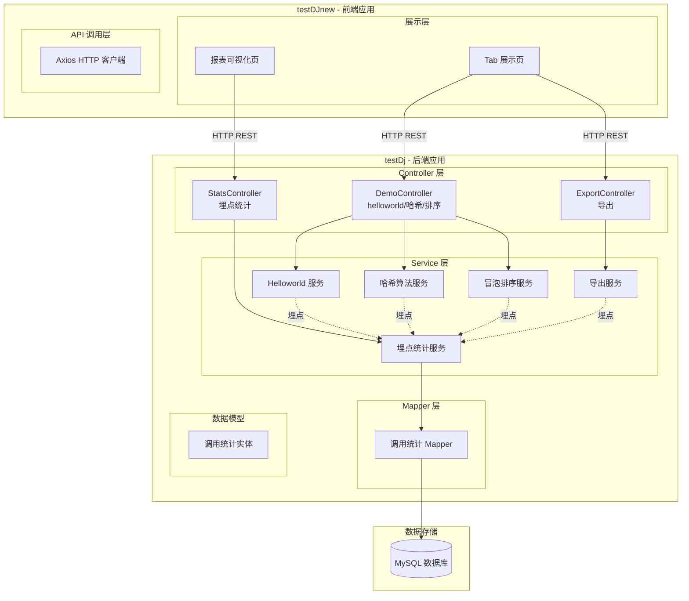

- **交互层说明**：testDJnew 前端应用提供 Tab 展示页和报表可视化页，通过 Axios HTTP 客户端调用后端 REST API
- **核心服务层说明**：testDj 后端应用采用 Controller-Service-Mapper 三层架构，提供演示接口、导出和统计功能
- **扩展/集成层说明**：本项不适用，无外部系统集成

### 模块清单

| 模块 | 职责 | 所属仓库 | 依赖 |
|------|------|----------|------|
| DemoController | 提供 helloworld/哈希/冒泡排序三个 REST 接口 | testDj 后端 | HelloService, HashService, SortService |
| ExportController | 提供导出接口，支持 CSV 导出各页面结果 | testDj 后端 | ExportService |
| StatsController | 提供埋点统计查询接口 | testDj 后端 | StatsService |
| HelloService | 实现 helloworld 逻辑 | testDj 后端 | 无 |
| HashService | 实现哈希算法（SHA-256） | testDj 后端 | 无 |
| SortService | 实现冒泡排序 | testDj 后端 | 无 |
| ExportService | 生成 CSV 格式导出数据 | testDj 后端 | 无 |
| StatsService | 处理埋点数据写入与查询 | testDj 后端 | StatsMapper |
| StatsMapper | 数据库层操作（MyBatis-Plus） | testDj 后端 | 数据库 |
| Tab 展示页 | 前端三个 Tab 展示各接口执行结果 | testDJnew 前端 | API 调用 |
| 报表可视化页 | 前端展示调用统计图表 | testDJnew 前端 | API 调用 + ECharts |

### 应用集成架构

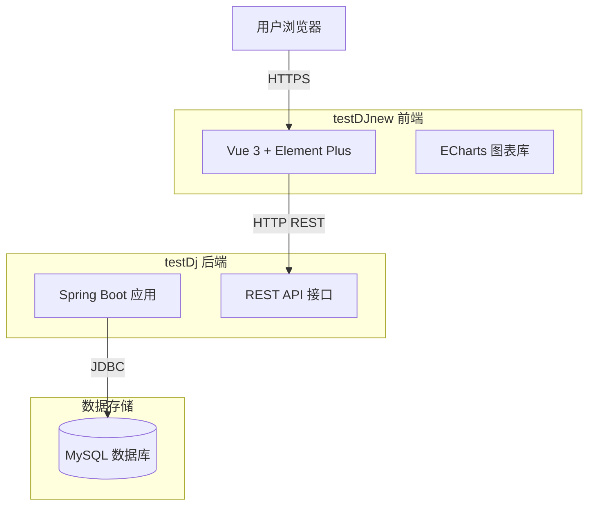

**集成关系说明：**

| 调用方 | 被调用方 | 协议 | 接口类型 | 说明 |
|--------|----------|------|----------|------|
| 用户浏览器 | testDJnew 前端 | HTTPS | Web 页面 | 用户访问前端页面 |
| 前端 Vue 应用 | 后端 Spring Boot | HTTP | REST API | Axios 调用后端接口 |
| 后端 Spring Boot | MySQL | JDBC | SQL | 埋点数据持久化 |

### 部署架构

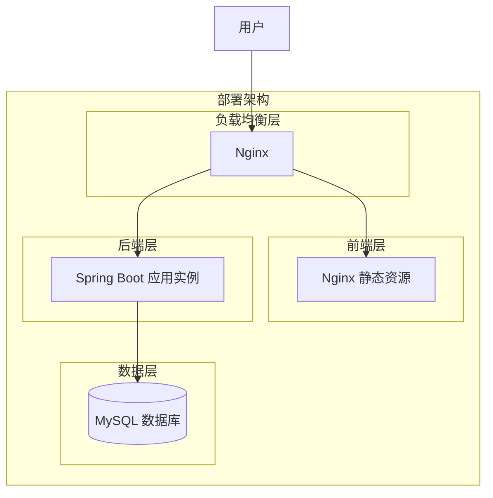

**部署说明：**
- **负载均衡层**：Nginx 代理前端静态资源和后端 API
- **前端层**：Nginx 托管 Vue 构建后的静态资源
- **后端层**：Spring Boot 应用，单实例部署
- **数据层**：MySQL 单库

## 3. 数据模型与存储

### 实体清单

| 实体名称 | 实体说明 | 所属模块 | 与其他实体的关系 |
|----------|----------|----------|-----------------|
| CallStats | 接口调用统计记录 | 埋点统计模块 | 无关联实体（独立记录） |
| ExportRecord | 导出操作记录（可选） | 导出模块 | 无关联实体 |

### 实体关系图

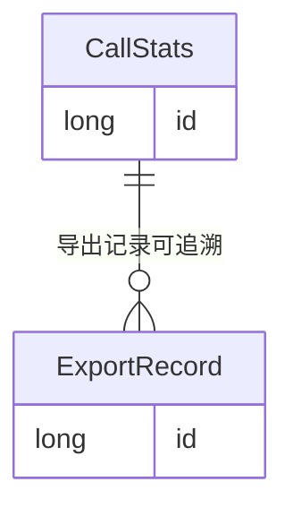

**模型说明：**
- CallStats 是核心实体，每次接口调用生成一条记录
- ExportRecord 是可选实体，记录导出操作
- 两个实体独立，无强关联关系

### 存储方案
- **数据库**：MySQL InnoDB 引擎
- **缓存**：本设计不涉及缓存
- **MQ**：本设计不涉及消息队列
- **租户隔离**：不涉及（单租户场景）

## 4. 接口设计

### 4.1 oneapi（Web 控制台接口）

| 编号 | 接口名称 | 方法 | 路径 | 模块 |
|------|----------|------|------|------|
| W01 | helloworld | GET | /api/demo/hello | DemoController |
| W02 | 哈希算法 | POST | /api/demo/hash | DemoController |
| W03 | 冒泡排序 | POST | /api/demo/sort | DemoController |
| W04 | 导出数据 | GET | /api/export/{type} | ExportController |
| W05 | 获取调用统计 | GET | /api/stats/summary | StatsController |
| W06 | 获取调用统计图表数据 | GET | /api/stats/chart | StatsController |

### 4.2 OpenAPI（对外接口）

本项不适用，原因：本系统为内部使用系统，不提供对外 OpenAPI。

### 4.3 内部接口（Service 层）

| 编号 | 接口名称 | 类 | 方法签名 |
|------|----------|------|----------|
| S01 | helloworld 业务 | HelloService | String hello(String name) |
| S02 | 哈希计算 | HashService | String hash(String input) |
| S03 | 冒泡排序 | SortService | List<Integer> sort(List<Integer> input) |
| S04 | 导出 CSV | ExportService | byte[] exportCsv(String type, Map<String,Object> params) |
| S05 | 记录调用埋点 | StatsService | void recordCall(CallStatsRecord record) |
| S06 | 查询统计汇总 | StatsService | StatsSummary getStatsSummary(StatsQuery query) |
| S07 | 查询图表数据 | StatsService | ChartData getChartData(ChartQuery query) |

### 4.4 集成接口（Integration 层）

本项不适用，原因：本系统不涉及外部系统集成。

## 5. 功能模块设计

### 5.1 Demo 模块

#### 5.1.1 表结构设计

本模块无独立数据表，使用 Stats 模块的 call_stats 表进行埋点记录。

##### 枚举与常量定义

本模块无枚举字段。

#### 5.1.2 接口详细设计

##### W01: helloworld 接口

- **URI**: GET /api/demo/hello
- **描述**: 返回问候语
- **入参**:

| 参数名称 | 类型 | 是否必填 | 描述 |
|----------|------|----------|------|
| name | String | 否 | 称呼名称，默认"World" |

- **出参**:

| 参数名称 | 类型 | 描述 |
|----------|------|------|
| code | String | 结果码 |
| msg | String | 提示信息 |
| data | Object | 业务数据 |

- **错误码**: 无特殊错误码

- **业务规则**: 
  - R01: 若 name 为空，返回 "Hello, World!"
  - R02: 若 name 非空，返回 "Hello, {name}!"

- **请求示例**:
```
GET /api/demo/hello?name=Alice
```

- **响应示例**:
```json
{
  "code": "OK",
  "msg": "SUCCESS",
  "data": {
    "message": "Hello, Alice!"
  }
}
```

##### W02: 哈希算法接口

- **URI**: POST /api/demo/hash
- **描述**: 对输入字符串计算 SHA-256 哈希值
- **入参**:

| 参数名称 | 类型 | 是否必填 | 描述 |
|----------|------|----------|------|
| input | String | 是 | 待哈希的字符串 |

- **出参**:

| 参数名称 | 类型 | 描述 |
|----------|------|------|
| code | String | 结果码 |
| msg | String | 提示信息 |
| data | Object | 业务数据 |

- **错误码**:

| 错误码 | 说明 |
|--------|------|
| DEMO_001 | input 参数为空 |

- **业务规则**: 
  - R01: 使用 SHA-256 算法
  - R02: 返回十六进制字符串

- **请求示例**:
```json
{
  "input": "hello"
}
```

- **响应示例**:
```json
{
  "code": "OK",
  "msg": "SUCCESS",
  "data": {
    "algorithm": "SHA-256",
    "input": "hello",
    "hash": "2cf24dba5fb0a30e26e83b2ac5b9e29e1b161e5c1fa7425e73043362938b9824"
  }
}
```

##### W03: 冒泡排序接口

- **URI**: POST /api/demo/sort
- **描述**: 对输入数组进行冒泡排序
- **入参**:

| 参数名称 | 类型 | 是否必填 | 描述 |
|----------|------|----------|------|
| numbers | List<Integer> | 是 | 待排序的整数数组 |

- **出参**:

| 参数名称 | 类型 | 描述 |
|----------|------|------|
| code | String | 结果码 |
| msg | String | 提示信息 |
| data | Object | 业务数据 |

- **错误码**:

| 错误码 | 说明 |
|--------|------|
| DEMO_001 | numbers 参数为空或长度不足 |

- **业务规则**: 
  - R01: 使用冒泡排序算法（升序）
  - R02: 返回排序前和排序后的数组

- **请求示例**:
```json
{
  "numbers": [64, 34, 25, 12, 22, 11, 90]
}
```

- **响应示例**:
```json
{
  "code": "OK",
  "msg": "SUCCESS",
  "data": {
    "original": [64, 34, 25, 12, 22, 11, 90],
    "sorted": [11, 12, 22, 25, 34, 64, 90],
    "algorithm": "BubbleSort"
  }
}
```

#### 5.1.3 子功能详细设计

##### 5.1.3.1 Helloworld 功能（F01）

- **处理时序图**
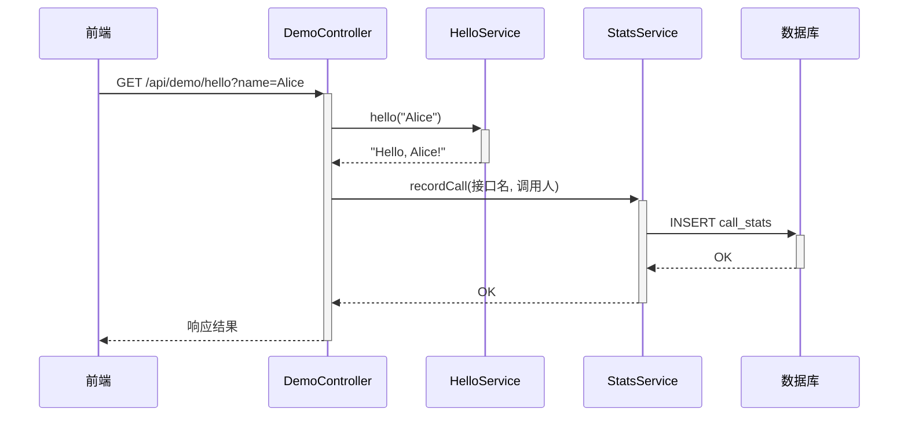

**业务规则：**
| 规则编号 | 规则描述 | 校验时机 | 不满足时的处理 |
|----------|----------|----------|--------------|
| R01 | name 为空时使用默认值 "World" | 参数解析时 | 使用默认值 |

**异常场景：**
| 异常场景 | 处理方式 |
|----------|----------|
| 服务内部异常 | 返回 DEMO_002 错误码 |

**并发控制：** 无并发风险，原因：纯查询/计算操作，无数据写入竞争。

##### 5.1.3.2 哈希算法功能（F02）

- **处理时序图**
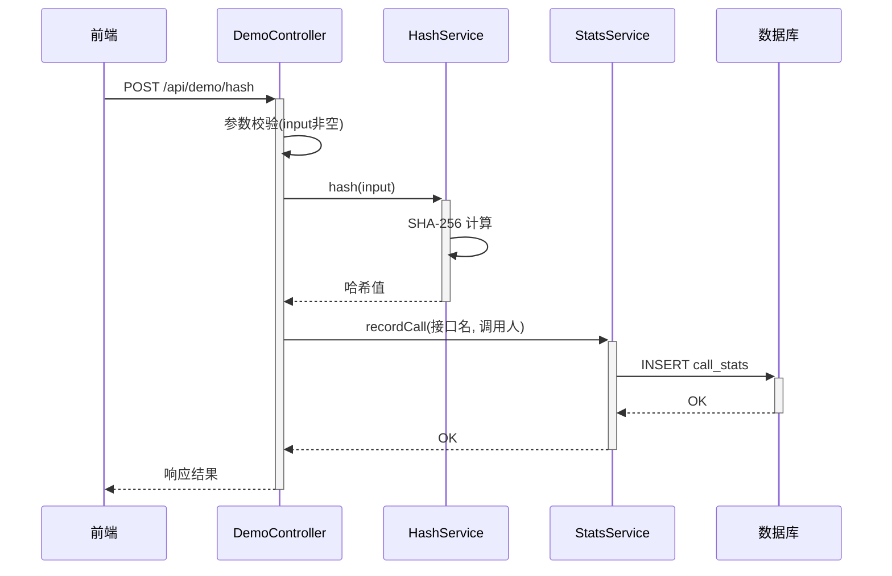

**业务规则：**
| 规则编号 | 规则描述 | 校验时机 | 不满足时的处理 |
|----------|----------|----------|--------------|
| R01 | input 参数不能为空 | 参数校验时 | 返回 DEMO_001 |

**异常场景：**
| 异常场景 | 处理方式 |
|----------|----------|
| input 为空 | 返回 DEMO_001 |
| 哈希算法异常 | 返回 DEMO_002 |

**并发控制：** 无并发风险，原因：纯计算操作。

##### 5.1.3.3 冒泡排序功能（F03）

- **处理时序图**
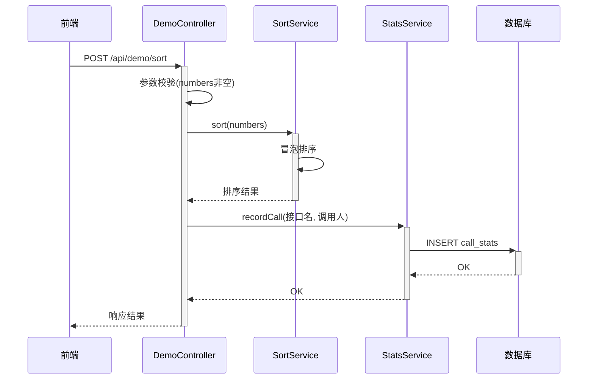

**业务规则：**
| 规则编号 | 规则描述 | 校验时机 | 不满足时的处理 |
|----------|----------|----------|--------------|
| R01 | numbers 不能为空或长度 < 2 | 参数校验时 | 返回 DEMO_001 |

**异常场景：**
| 异常场景 | 处理方式 |
|----------|----------|
| numbers 为空或长度不足 | 返回 DEMO_001 |
| 排序异常 | 返回 DEMO_002 |

**并发控制：** 无并发风险，原因：纯计算操作。

### 5.2 导出模块

#### 5.2.1 表结构设计

本模块无独立数据表。

##### 枚举与常量定义

| 枚举名称 | 取值 | 含义 | 关联字段 |
|----------|------|------|----------|
| ExportType | hello | 导出 helloworld 结果 | 请求参数 type |
| ExportType | hash | 导出哈希算法结果 | 请求参数 type |
| ExportType | sort | 导出冒泡排序结果 | 请求参数 type |
| ExportType | stats | 导出统计报表数据 | 请求参数 type |

#### 5.2.2 接口详细设计

##### W04: 导出数据接口

- **URI**: GET /api/export/{type}
- **描述**: 根据类型导出对应页面数据为 CSV 文件
- **入参**:

| 参数名称 | 类型 | 是否必填 | 描述 |
|----------|------|----------|------|
| type | String (Path) | 是 | 导出类型：hello/hash/sort/stats |
| name | String | 否 | helloworld 的 name 参数（type=hello 时生效） |
| input | String | 否 | 哈希的 input 参数（type=hash 时生效） |
| numbers | String | 否 | 排序的 numbers 参数（type=sort 时生效，逗号分隔） |

- **出参**: 返回 CSV 文件流（Content-Type: text/csv）
- **错误码**:

| 错误码 | 说明 |
|--------|------|
| EXPORT_001 | 不支持的导出类型 |

- **业务规则**: 
  - R01: 根据 type 参数调用对应接口获取数据，再生成 CSV
  - R02: CSV 文件头包含中文，文件编码 UTF-8 with BOM

- **请求示例**:
```
GET /api/export/hello?name=Alice
```

- **响应示例**: CSV 文件流，Content-Disposition: attachment; filename=hello_export.csv

#### 5.2.3 子功能详细设计

##### 5.2.3.1 导出功能（F05）

- **处理时序图**
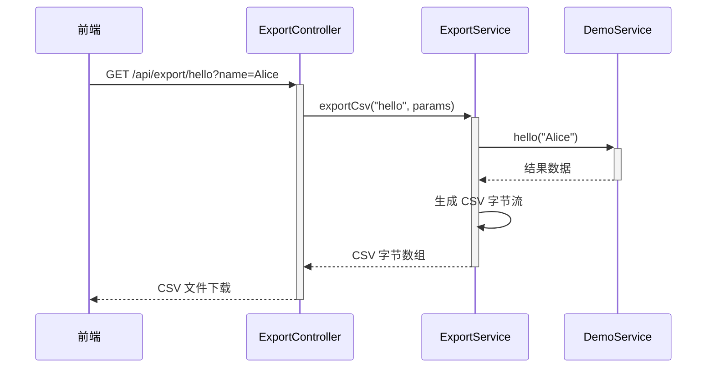

**业务规则：**
| 规则编号 | 规则描述 | 校验时机 | 不满足时的处理 |
|----------|----------|----------|--------------|
| R01 | type 必须在支持范围内 | 请求处理时 | 返回 EXPORT_001 |

**异常场景：**
| 异常场景 | 处理方式 |
|----------|----------|
| 不支持的导出类型 | 返回 EXPORT_001 |
| 内部服务异常 | 返回 DEMO_002 |

**并发控制：** 无并发风险，原因：纯查询/计算操作。

### 5.3 埋点统计模块

#### 5.3.1 表结构设计

##### 5.3.1.1 call_stats（调用统计表）

| 字段名 | 数据类型 | 约束 | 默认值 | 说明 |
|--------|----------|------|--------|------|
| id | bigint | PK, 自增 | - | 系统自增主键 |
| api_name | varchar(64) | NOT NULL | - | 接口名称，如 hello/hash/sort |
| caller_id | varchar(64) | NOT NULL | - | 调用人 ID |
| caller_name | varchar(128) | NOT NULL | - | 调用人姓名 |
| caller_type | varchar(32) | NULL | - | 人员类型，如 正式/实习/外包 |
| caller_level | varchar(32) | NULL | - | 人员层级，如 P5/P6/P7 |
| caller_dept | varchar(128) | NULL | - | 人员部门，如 技术部/产品部 |
| call_params | text | NULL | - | 调用参数（JSON 格式） |
| call_result | varchar(32) | NOT NULL | - | 调用结果，SUCCESS/FAIL |
| call_duration | int | NOT NULL | 0 | 调用耗时（毫秒） |
| gmt_create | datetime | NOT NULL | CURRENT_TIMESTAMP | 创建时间 |
| gmt_modified | datetime | NOT NULL | CURRENT_TIMESTAMP | 修改时间 |

**索引：**
- PK: `pk_call_stats` (id)
- IDX: `idx_call_stats_api_name` (api_name)
- IDX: `idx_call_stats_caller_id` (caller_id)
- IDX: `idx_call_stats_caller_type` (caller_type)
- IDX: `idx_call_stats_caller_level` (caller_level)
- IDX: `idx_call_stats_caller_dept` (caller_dept)
- IDX: `idx_call_stats_gmt_create` (gmt_create)

##### 5.3.1.2 枚举与常量定义

| 枚举名称 | 取值 | 含义 | 关联字段 |
|----------|------|------|----------|
| ApiName | hello | helloworld 接口 | call_stats.api_name |
| ApiName | hash | 哈希算法接口 | call_stats.api_name |
| ApiName | sort | 冒泡排序接口 | call_stats.api_name |
| CallResult | SUCCESS | 调用成功 | call_stats.call_result |
| CallResult | FAIL | 调用失败 | call_stats.call_result |

#### 5.3.2 接口详细设计

##### W05: 获取调用统计汇总接口

- **URI**: GET /api/stats/summary
- **描述**: 获取调用统计的汇总数据，包含总调用次数、各接口调用次数等
- **入参**:

| 参数名称 | 类型 | 是否必填 | 描述 |
|----------|------|----------|------|
| startDate | String | 否 | 开始日期，格式 yyyy-MM-dd |
| endDate | String | 否 | 结束日期，格式 yyyy-MM-dd |

- **出参**:

| 参数名称 | 类型 | 描述 |
|----------|------|------|
| code | String | 结果码 |
| msg | String | 提示信息 |
| data | Object | 统计汇总数据 |

- **data 结构**:

| 参数名称 | 类型 | 描述 |
|----------|------|------|
| totalCalls | int | 总调用次数 |
| apiStats | List<ApiStat> | 各接口调用统计 |
| apiStats[].apiName | String | 接口名称 |
| apiStats[].callCount | int | 调用次数 |

- **错误码**: 无特殊错误码

- **请求示例**:
```
GET /api/stats/summary?startDate=2026-01-01&endDate=2026-12-31
```

- **响应示例**:
```json
{
  "code": "OK",
  "msg": "SUCCESS",
  "data": {
    "totalCalls": 150,
    "apiStats": [
      {"apiName": "hello", "callCount": 50},
      {"apiName": "hash", "callCount": 60},
      {"apiName": "sort", "callCount": 40}
    ]
  }
}
```

##### W06: 获取调用统计图表数据接口

- **URI**: GET /api/stats/chart
- **描述**: 获取按维度分组的统计图表数据，支持折线图/饼图/柱状图
- **入参**:

| 参数名称 | 类型 | 是否必填 | 描述 |
|----------|------|----------|------|
| dimension | String | 是 | 统计维度：caller_type/caller_level/caller_dept/api_name |
| chartType | String | 是 | 图表类型：line/pie/bar |
| startDate | String | 否 | 开始日期 |
| endDate | String | 否 | 结束日期 |

- **出参**:

| 参数名称 | 类型 | 描述 |
|----------|------|------|
| code | String | 结果码 |
| msg | String | 提示信息 |
| data | Object | 图表数据 |

- **data 结构**:

| 参数名称 | 类型 | 描述 |
|----------|------|------|
| dimension | String | 统计维度 |
| chartType | String | 图表类型 |
| categories | List<String> | 分类标签（X轴） |
| series | List<Series> | 数据系列 |
| series[].name | String | 系列名称 |
| series[].data | List<Integer> | 系列数据 |

- **错误码**:

| 错误码 | 说明 |
|--------|------|
| STATS_001 | 维度参数不合法 |

- **请求示例**:
```
GET /api/stats/chart?dimension=caller_type&chartType=bar&startDate=2026-01-01&endDate=2026-12-31
```

- **响应示例**:
```json
{
  "code": "OK",
  "msg": "SUCCESS",
  "data": {
    "dimension": "caller_type",
    "chartType": "bar",
    "categories": ["正式", "实习", "外包"],
    "series": [
      {
        "name": "调用次数",
        "data": [80, 40, 30]
      }
    ]
  }
}
```

#### 5.3.3 子功能详细设计

##### 5.3.3.1 埋点记录功能（F06）

- **处理时序图**
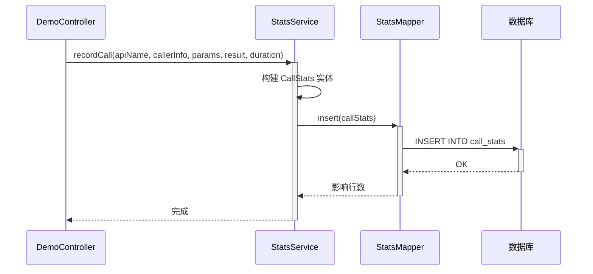

**业务规则：**
| 规则编号 | 规则描述 | 校验时机 | 不满足时的处理 |
|----------|----------|----------|--------------|
| R01 | 埋点记录不能阻塞主流程 | 调用时 | 异步记录，失败不影响主流程 |

**异常场景：**
| 异常场景 | 处理方式 |
|----------|----------|
| 数据库写入失败 | 日志记录错误，不影响主业务流程 |

**并发控制：** 无并发风险，原因：仅插入操作，无更新冲突。

##### 5.3.3.2 统计查询功能（F07）

- **处理时序图**
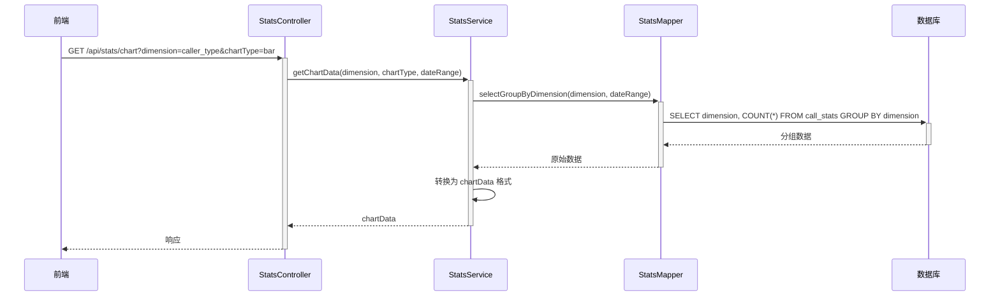

**业务规则：**
| 规则编号 | 规则描述 | 校验时机 | 不满足时的处理 |
|----------|----------|----------|--------------|
| R01 | dimension 必须在支持范围内 | 查询时 | 返回 STATS_001 |
| R02 | 日期范围默认最近 30 天 | 参数未传时 | 使用默认值 |

**异常场景：**
| 异常场景 | 处理方式 |
|----------|----------|
| 维度参数不合法 | 返回 STATS_001 |
| 数据库查询异常 | 返回 STATS_001 |

**并发控制：** 无并发风险，原因：纯查询操作。

### 5.4 前端展示模块

#### 5.4.1 表结构设计

本项不适用，原因：前端无数据表。

##### 枚举与常量定义

本模块无枚举字段。

#### 5.4.2 接口详细设计

前端调用后端接口已在 W01-W06 中定义，此处不再重复。

#### 5.4.3 子功能详细设计

##### 5.4.3.1 Tab 展示页功能（F04）

- **页面结构**

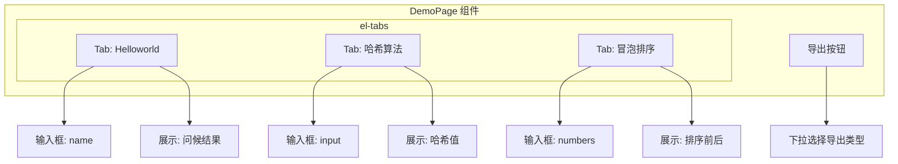

**业务规则：**
| 规则编号 | 规则描述 | 校验时机 | 不满足时的处理 |
|----------|----------|----------|--------------|
| R01 | 每个 Tab 独立调用对应接口 | Tab 切换时 | 自动加载 |
| R02 | 导出按钮统一在页面顶部 | 始终 | - |

**异常场景：**
| 异常场景 | 处理方式 |
|----------|----------|
| 接口调用失败 | 页面展示错误提示 |
| 导出失败 | 展示错误消息 |

##### 5.4.3.2 可视化报表功能（F07）

- **页面结构**

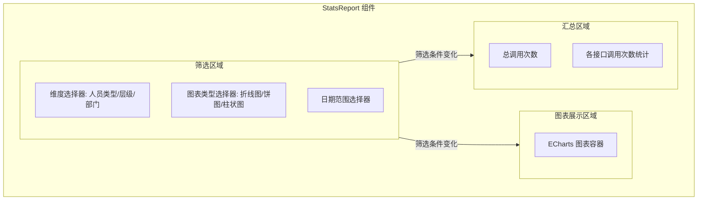

**业务规则：**
| 规则编号 | 规则描述 | 校验时机 | 不满足时的处理 |
|----------|----------|----------|--------------|
| R01 | 维度切换时重新请求图表数据 | 维度变化时 | 自动刷新 |
| R02 | 图表类型切换时重新渲染 | 图表类型变化时 | 前端切换图表类型 |
| R03 | 默认维度为"人员类型"，默认图表为柱状图 | 首次加载 | 加载默认数据 |

**图表展示形式：**
| 图表类型 | 展示形式 | 适用维度 |
|----------|----------|----------|
| 折线图 (line) | X轴为时间维度，Y轴为调用次数 | 按时间趋势展示 |
| 饼图 (pie) | 展示各分类占比 | 人员类型、人员层级、部门 |
| 柱状图 (bar) | X轴为分类，Y轴为调用次数 | 人员类型、人员层级、部门、接口名称 |

**异常场景：**
| 异常场景 | 处理方式 |
|----------|----------|
| 统计数据为空 | 展示"暂无数据"占位图 |
| 接口请求失败 | 展示错误提示，保留上次数据 |

## 6. 非功能性需求设计

### 6.1 高可用性
本系统为演示/开发环境，单实例部署即可。生产环境可考虑：
- 后端多副本部署 + Nginx 负载均衡
- 数据库主从架构

### 6.2 可扩展性
- 接口扩展：新增接口只需在 Controller 中添加方法，并接入 StatsService 埋点即可
- 维度扩展：埋点维度可扩展，只需在 call_stats 表新增字段
- 图表类型扩展：前端 ECharts 支持多种图表类型，后端数据格式可复用

### 6.3 稳定性/可靠性
- 埋点写入采用同步方式，但异常不影响主流程
- 数据库写入失败仅记录日志，不影响主业务响应

### 6.4 安全性设计

#### 6.4.1 账户系统方案
本项不适用，原因：本系统不涉及用户认证，调用人信息通过请求头模拟传入。

#### 6.4.2 授权 & 访问控制

##### 6.4.2.1 是否实现水平权限检查
本项不适用，原因：本系统为公共演示系统，不涉及租户隔离或资源级权限。

##### 6.4.2.2 是否实现垂直权限检查
本项不适用，原因：本系统不涉及角色权限管理。

##### 6.4.2.3 是否检查登录态
本项不适用，原因：本系统为开发演示系统，不检查登录态。

#### 6.4.3 数据防护方案

##### 6.4.3.1 是否对敏感数据加密存储
本项不适用，原因：本系统不涉及敏感数据（如身份证、手机号等）。

##### 6.4.3.2 是否对敏感数据展示进行脱敏
本项不适用，原因：本系统不涉及敏感数据展示。

### 6.5 监控/统计/日志/告警
- 应用日志：使用 SLF4J + Logback 记录所有接口调用和异常
- 埋点统计：通过 call_stats 表记录所有接口调用情况
- 告警：本系统暂不涉及告警

## 7. 变更三板斧

### 7.1 可监控
- 埋点监控：通过 call_stats 表记录所有接口的调用次数、调用人、耗时、结果
- 日志监控：应用日志记录所有关键操作
- 可监控指标：

| 指标 | 来源 | 说明 |
|------|------|------|
| 接口调用次数 | call_stats 表 | 按接口/时间统计 |
| 接口调用耗时 | call_stats.call_duration | 平均/最大/P99 耗时 |
| 接口成功率 | call_stats.call_result | 成功/失败比例 |
| 调用人分布 | call_stats.caller_* | 按人员类型/层级/部门统计 |

### 7.2 可灰度
本项不适用，原因：本系统为演示系统，无灰度发布需求。

### 7.3 可应急
- 强制降级：若 MySQL 不可用，埋点功能可降级（跳过写入），不影响主业务接口
- 接口开关：可在 Nginx 层面控制接口的访问
- 回滚方案：发布包回滚兜底，无特殊依赖关系